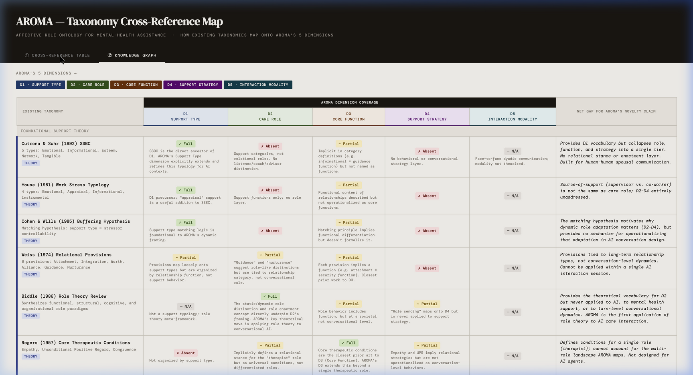

# AROMA: Affective Role Ontology for Mental-health Assistance

**AROMA** is a five-dimensional framework designed to formalize the role structure of AI-mediated mental health support interactions. 

Existing frameworks in Human-Computer Interaction (HCI) and clinical psychology often evaluate AI systems strictly by the interventions they provide or the models they use. AROMA argues that this misses the fundamental relational dynamics at play: **What role is the AI taking in the interaction, and how does that role adapt to the user's needs?**

Our core research question is: *"What is the role structure of AI-mediated mental health support interactions?"*

## The 5 Dimensions of AROMA

1. **D1: Support Type**  
   The foundational dimension identifying the specific need a user is expressing (e.g., emotional, informational, esteem). It is grounded in established support typologies like the Social Support Behavior Code (Cutrona & Suhr, 1992).
2. **D2: Care Role**  
   The stable relational stance an AI adopts toward a user (e.g., Listener, Coach, Companion). This is the core theoretical addition of AROMA—applying Role Theory (Biddle, 1986) to conversational AI.
3. **D3: Core Function**  
   The intended psychological outcome or functional goal that a Care Role aims to produce (e.g., emotional validation, insight generation).
4. **D4: Support Strategy**  
   The concrete, observable conversational tactics the system uses to execute its role (e.g., reflective listening, providing resources). 
5. **D5: Interaction Modality**  
   The communicative medium (text, voice, embodied avatar) which acts as a structural constraint on which roles and strategies are viable.

## Project Phases

This repository tracks the progress of the AROMA project toward a CHI paper submission. The project is organized into the following phases:

| Phase | Status | Description | Deliverables |
| :--- | :--- | :--- | :--- |
| **0. Theoretical Framework** | Complete | Formalizing the dimensions and the core theoretical argument (Authority-Agency Paradox). | • AROMA Framework Spec<br>• Human-Role Compatibility Matrix<br>• Core Theoretical Argument |
| **1. Taxonomy Development** | In Progress | Generating candidate roles grounded in existing literature and building the initial codebook. | • Codebook v0.1<br>• Literature-Grounded Role Definitions |
| **2. Data Collection** | Not Started | Gathering and preprocessing conversational datasets that feature AI-mediated mental health support. | • Fully Preprocessed Dataset<br>• Selected Unit of Analysis |
| **3. Human Coding** | Not Started | Applying the codebook to the primary dataset, resolving inter-rater reliability (IRR) conflicts. | • Validated Coding Protocol<br>• Inter-Rater Reliability Scores |
| **4. Expert Validation** | Not Started | Interviewing clinical and HCI experts to refine the theoretical taxonomy against real-world use cases. | • Expert Interview Protocol<br>• Finalized Codebook v1.0 |
| **5. Classification Pipeline** | Not Started | Building an automated NLP classification pipeline using the validated taxonomy. | • Training Data<br>• Baseline Evaluation Metrics |
| **6. Evaluation** | Not Started | Evaluating the pipeline's performance and conducting a qualitative analysis of its impact. | • Blind Human Review Results<br>• Comprehensive Error Analysis |
| **7. Writing** | Not Started | Drafting the final manuscript for CHI. | • Final CHI Submission |

## Repository Contents

*   `/phase_*`: Detailed notes, drafts, and data for each project phase.
*   `cross-ref.html`: An interactive D3.js Knowledge Graph mapping existing literature (House, Cohen, Vaidyam, etc.) against AROMA's 5 dimensions to visualize the novelty gap. (Run locally via a web server).



*   `authority_agency.md`: Theoretical exploration of the "Therapeutic Misconception" and the Authority-Agency paradox in AI care.

## Running the Cross-Reference Map

To view the interactive D3 visualizer evaluating AROMA against prior literature:
```bash
# Start a local web server (Python or Node)
npx serve .
# Or string standard Python: python3 -m http.server 3000

# Open cross-ref.html in your browser via localhost
```
