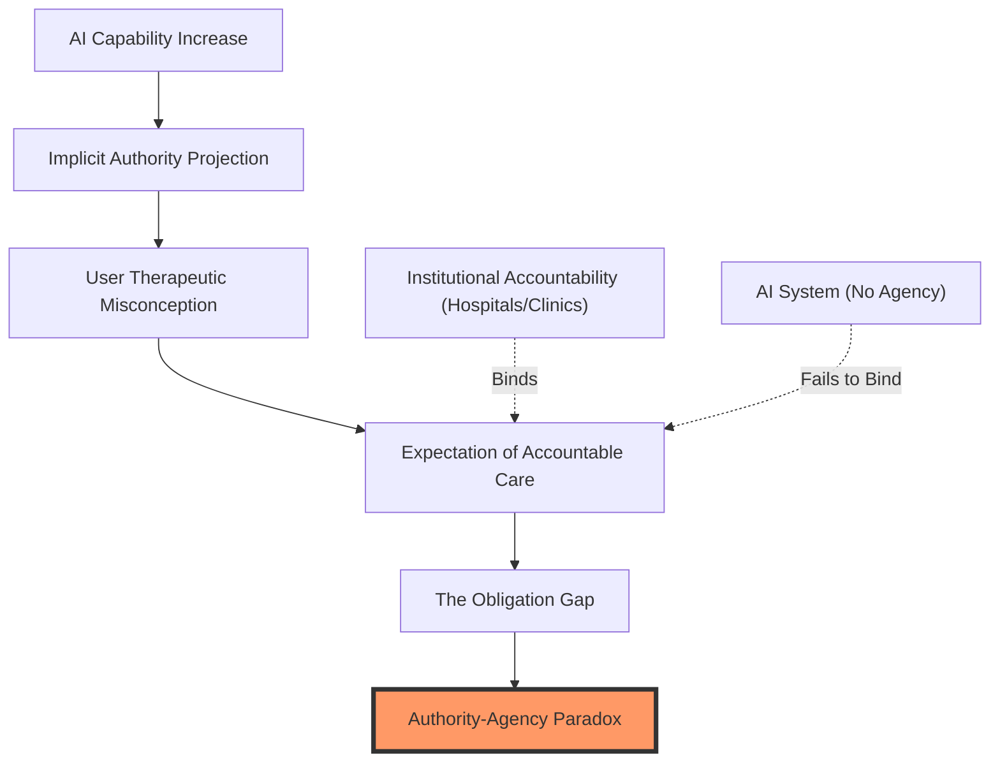

# AROMA: A Multi-Dimensional Taxonomy of Caregiving Roles in AI-Mediated Mental Health Support

## Abstract

AI mental health systems often confuse *what* support they provide with *who* they are being. By merging support type, care role, and strategy into a single label, designers create **role-locked** agents—systems trapped in one relational stance regardless of the user's changing needs. We present AROMA, a three-dimensional taxonomy separating Support Type (D1), Care Role (D2), and Support Strategy (D3). Grounded in a 203-paper literature synthesis, AROMA offers three contributions: (C1) The Authority-Agency Paradox, a structural lens for evaluating AI safety; (C2) A three-dimension, six-role ontology; and (C3) A dual-annotator computational methodology that filters conversational noise to generate high-quality ground-truth relational labels.

---

## 1. Introduction

The field of AI-mediated mental health support has a structural problem that better language models cannot fix. Current systems confuse two distinct elements: *Support Type* (the category of need, like emotional or informational) and *Care Role* (the AI's relational stance, like listener or advisor). Dominant frameworks map out support types perfectly but ignore the relational stance required to deliver that support safely.

When AI adopts authoritative roles—like an Advisor giving medical guidance—it enters dangerous ethical territory. We define this as the **Authority-Agency Paradox**: the AI performs the behaviors of an authority figure but lacks the institutional capacity or accountability to back it up. This creates an **obligation gap** where neither the AI nor the user is actually bound by care agreements. Ultimately, this leads to a **therapeutic misconception**: users act as if they are receiving governed, accountable care when they are not.

This paradox requires a structural design response. AROMA provides that response by strictly separating Support Type (D1), Care Role (D2), and Support Strategy (D3). 

*Figure 1: The Authority-Agency Paradox - showing the structural disconnect between projected authority and institutional agency.*

	This separation allows designers to detect when a role transition is needed and safely calibrate the AI's stance. For example, when a user shifts from venting (Emotional support) to asking for options (Informational support), an AROMA-aware system can explicitly transition from a *Listener* to an *Advisor*, adjusting its epistemic framing to ensure it doesn't overstep its agency.

This paper makes three primary contributions:
1. **C1: The Authority-Agency Paradox** — A theoretical framework for predicting AI care failures.
2. **C2: The AROMA Taxonomy** — A three-dimension, six-role ontology.
3. **C3: A Computational Annotation Pipeline** — A dual-annotator methodology (Heuristic + LLM) that successfully operationalizes these dimensions on real conversations.

---

## 2. Related Work

### 2.1 Support Type Taxonomies
The dominant framework for supportive behavior is Cutrona and Suhr's (1992) Social Support Behavior Code (SSBC). It identifies emotional, informational, esteem, network, and tangible support. Lazarus and Folkman (1984) later added appraisal support. While durable, these frameworks have a massive blind spot: they ignore the *relational stance* of the provider. 

In AI contexts, this omission is hazardous. Informational support feels completely different coming from an authoritative medical AI versus a peer-support chatbot. AROMA fixes this by treating Support Type (D1) and Care Role (D2) as orthogonal, independent dimensions.

### 2.2 AI Role Frameworks
Existing frameworks classify AI systems by their high-level clinical function (e.g., screening, therapy delivery, monitoring). This creates system-level labels (e.g., "Woebot is a therapy agent"). Designing at the system level directly causes role-locking: if the system *is* a coach, every single turn must be coaching. Previous frameworks cannot handle the fact that a user's needs might drastically shift within five minutes of conversation.

### 2.3 Conversational Support Research
Research into conversational strategy provides the foundation for our D3 (Support Strategy) dimension. Feng's (2009) Integrated Model of Advice-giving shows that support follows a sequence: emotional validation precedes problem exploration, which precedes advice. 

More recently, Liu et al. (2021) developed the ESConv dataset, defining specific emotional support strategies like self-disclosure, affirmation, and restatement. However, a strategy like "restatement" behaves very differently depending on the AI's role: a Listener restates to validate, while a Reflective Partner restates to prompt clinical reappraisal. The strategy remains identical, but the relational context changes its impact.

### 2.4 The Gap
No existing framework meets all three design requirements. None actively separate support type from care role. None account for dynamic role transitions within a single conversation. And none structurally predict why authoritative AI roles inherently trigger ethical failures. The AROMA framework addresses all three.

---

## 3. The AROMA Framework

AROMA organizes AI caregiving along three orthogonal dimensions:

**D1 — Support Type:** The category of need being addressed (Emotional, Informational, Esteem, Network, Tangible, Appraisal).
**D2 — Care Role:** The stable relational stance the AI adopts across a 3–5 turn sequence. Roles dictate which boundaries and support types are appropriate.
**D3 — Support Strategy:** The concrete conversational tactic used in a single utterance (e.g., Restatement, Self-disclosure).

### 3.1 The Six Care Roles and Falsifiability Constraints
We identified six distinct care roles from our literature synthesis. Each role had to appear in at least three independent papers and produce distinct behaviors.

| Role | Stance | Primary D1 | Primary Function | Paradox Level | Invited Human Role |
|---|---|---|---|---|---|
| **Listener** | Receptive, non-directive | Emotional | Validation | Low | Witness-seeker |
| **Reflective Partner** | Curious, exploratory | Appraisal | Insight generation | Low | Client, Explorer |
| **Coach** | Directive, forward-looking | Esteem | Self-efficacy building | Moderate | Self-manager, Goal-seeker |
| **Advisor** | Authoritative, informational | Informational | Decision support | **High** | Patient, Student |
| **Companion** | Warm, co-present | Emotional | Sustained presence | Low | Peer-seeker |
| **Navigator** | Practical, resource-oriented | Network, Tangible | Resource connection | **High** | Advocate-seeker |

*(Note: The empirical boundary between the Listener and Reflective Partner roles is particularly nuanced. Operationally, a Listener relies almost entirely on passive emotional validation, whereas a Reflective Partner crosses the boundary by leveraging Socratic questioning and targeted cognitive reappraisal to actively shift the user's perspective.)*

To ensure robustness, AROMA follows strict taxonomy ending conditions (Nickerson et al., 2013): (a) all AI care interactions must be classifiable by all three dimensions, (b) no new roles emerged during our final testing, and (c) the taxonomy remains falsifiable. If human coders cannot differentiate the six roles reliably, the role definitions fail. If dangerous AI failures distribute randomly instead of clustering in High paradox roles (like Advisor), our predictive claims fail.

### 3.2 The Orthogonality of Role (D2) and Strategy (D3)
The core claim of AROMA is that role (D2) and concrete utterance strategy (D3) are separate. What defines a role is the stable relational stance over a sequence of turns, not a single utterance. 

To illustrate why this separation is vital, consider the exact same conversational strategy—**Restatement**—deployed under two different roles:
- **As a Listener:** "It sounds like you are feeling incredibly overwhelmed right now." *(Goal: Pure emotional validation and witnessing.)*
- **As a Reflective Partner:** "It sounds like you are feeling overwhelmed right now—do you think that's because of the workload, or because you feel unsupported?" *(Goal: Socratic reframing and insight generation.)*

The literal utterance strategy is identical, but the relational stance dictates entirely different safety constraints and user outcomes.

### 3.3 The Authority-Agency Paradox
Human care is bound by mutual obligations: the provider must act competently and the receiver must commit to recovery. AI dissolves this binding. The AI receives the authority of a caregiver but lacks the institutional agency or accountability to deliver real care.

As a result, users suffer a **therapeutic misconception**: they act as if they are receiving governed clinical care when they are structurally unsupported. The risk level depends directly on the adopted Care Role:

- **Low Paradox (Listener, Reflective Partner, Companion):** Users do not expect clinical authority. The main risks are quality failures like hollow empathy or pseudo-intimacy.
- **Moderate Paradox (Coach):** The AI sets goals but cannot enforce accountability.
- **High Paradox (Advisor, Navigator):** Users project heavy clinical authority. Documented AI failures cluster heavily here (e.g., eating-disorder chatbots giving harmful calorie advice). 

---

## 4. Literature Synthesis: Methods and Results

### 4.1 Corpus Construction
We generated an initial 293-paper corpus by exhaustively searching OpenAlex (2015–2025) using targeted conceptual queries (e.g., 'AI', 'mental health', 'chatbot', 'role', 'relational agent'). Following title/abstract screening, we applied strict inclusion criteria (filtering for peer-reviewed English publications explicitly discussing AI care systems or relational dynamics), yielding a final curated corpus of 203 papers. Every paper was coded against AROMA's three dimensions. D2 (Care Role) immediately stood out as a massive point of terminological confusion in the field.

### 4.2 Terminological Fragmentation
Using targeted automated n-gram extraction validated by qualitative coding, we identified 34 different role-like terms in the literature. We then systematically mapped these varying surface terms back into the six clean AROMA Care Roles.

| AROMA Care Role | Example Absorbed Literature Terms |
|---|---|
| **Coach** | Coach, virtual coach, AI coach, wellness coach, health coach |
| **Advisor** | Therapist, counselor, sim-physician, therapist-lite, medical agent |
| **Companion** | Companion, virtual friend, pseudo-intimate partner, nurturer |
| **Navigator** | Peer-bridger, connector, resource-finder |
| **Listener** | *(No distinct role terms mined; exists as behavioral strategy)* |
| **Reflective Partner** | *(No distinct role terms mined; exists as behavioral strategy)* |

This fragmentation is a key finding. The Coach role alone was referred to using five different names across the literature. Crucially, the "Listener" and "Reflective Partner" roles had zero distinct names extracted; the literature frequently describes active listening behaviors, but formalizes them only as conversational strategies rather than distinct relational identities. While it is possible our extraction methods inherently miss ubiquitous strategies, this highlights our core argument: the field lacks a dedicated vocabulary for relational stance.

### 4.3 Authority-Agency Paradox Signals
Ten papers contained direct evidence of the Authority-Agency Paradox, clustering neatly into Low-paradox *Companion* pseudo-intimacy failures and High-paradox *Advisor* safety gaps. For example, literature routinely cites the Tessa eating-disorder chatbot (an *Advisor*) causing active harm by dispensing unsolicited, rigid calorie-restriction advice—a direct result of assuming clinical authority without the agency to monitor patient capacity. Most of these papers were published after 2024, indicating the field is only just beginning to recognize the structural problem AROMA solves.

---

## 5. Computational Operationalization

To empirically validate AROMA and provide a computational toolkit for detecting role-locking, we operationalized the framework on ESConv (Liu et al., 2021)—a dataset of 1,300 peer-support conversations comprising 18,376 supporter turns.

Our strategy uses a staggered, three-model architecture to isolate the dimensions:

### 5.1 Heuristic Corpus Analysis: A Two-Type World
We first ran a deterministic Heuristic rules-engine over the full 18,376-turn corpus to establish a structural baseline. This engine hard-maps known ESConv D3 utterance strategies (e.g., "Information") directly into AROMA D1 categories (e.g., "Informational Support").

| Support Type (D1) | Turn Count | Percentage |
|---|---|---|
| Emotional | 10,561 | 57.5% |
| Informational | 7,138 | 38.8% |
| Network | 369 | 2.0% |
| Esteem | 211 | 1.1% |
| Appraisal | 49 | 0.3% |
| Tangible | 48 | 0.3% |

This revealed a stark finding: ESConv operates almost entirely in a two-type world (Emotional and Informational). Four of Cutrona & Suhr's classic support types are structurally underserved. This empirical reality directly motivates why role-locking is dangerous: current training datasets barely expose AI to Network, Esteem, Appraisal, or Tangible support contexts. Consequently, mental health chatbots trained on generic dialog corpuses have no generative fluency to fall back on when a user's needs shift toward those areas, leaving the AI trapped in its default behavior.

*Figure 2: LLM-Adjudicated Support Type (D1) Distribution - proving the overwhelming skew toward Emotional and Informational Support in the ESConv corpus.*

### 5.2 Annotator Baselines: Heuristic vs. LLM
We then used two independent annotators to establish ground-truth labels across a stratified sample of 400 sequences (padded with 5 turns of conversational history context):

1. **Heuristic Classifier (Annotator 1):** Fast and scalable, but struggles with nuanced boundary conditions.
2. **LLM-as-Judge (Annotator 2):** A non-deterministic classifier utilizing a frontier LLM (e.g., Claude 3 Haiku, chosen for its balance of high-speed inference and precise instruction-following over complex multi-turn context windows) zero-shot prompted with the complete AROMA taxonomy codebook. It evaluates the full 5-turn sliding context window to accurately judge the overarching Care Role (D2).

By extracting the sequences where the Heuristic and LLM classifiers agree, we filter out noise to create a highly rigid ground-truth dataset.

### 5.3 Dimensionality Reduction and Semantic Entanglement
To validate that AROMA's taxonomy exists mathematically within raw language, we pushed our 385 agreement-filtered sequences through a dense `SentenceTransformer` and mapped the 384-dimensional arrays into 2D space using Principal Component Analysis (PCA). 

The results establish a profound structural hierarchy within the taxonomy. D1 (Support Type) exhibited distinct, soft-clustered separation between Informational and Emotional utterances, proving that Support Type maps directly to the isolated semantic surface of a sentence. However, D2 (Care Roles) were heavily intermixed in the unsupervised embedding space—roles like *Reflective Partner* and *Companion* overlapped almost entirely.

This confirms our core theoretical claim: Care Role (D2) cannot be detected from single-turn semantics. A *Reflective Partner* and a *Companion* utilize identical linguistic structures, but differ entirely based on their historical sequential context. Because the PCA explained variance remained strictly low (13.3%), this empirically mandates the necessity of a supervised, context-aware downstream neural classifier (rather than unsupervised clustering) to successfully detect safe role boundaries.

*Figure 3: Principal Component Analysis (PCA) of 385 sequences. Left: D1 (Support Type) shows soft semantic clustering. Right: D2 (Care Role) shows heavy intermixing, proving that relational stance is invisible to unsupervised semantic vectors.*

### 5.4 Actual D2 Distribution Findings
Actual runs of the LLM pipeline consistently classified Care Roles as heavily skewed toward **Reflective Partner** (30.5%) and **Companion** (25.3%), accurately reflecting ESConv's peer-support, non-clinical environment. Directive roles like Advisor (10.2%) were rare.

| Care Role (D2) | LLM Classification Count | Percentage |
|---|---|---|
| Reflective Partner | 122 | 30.5% |
| Companion | 101 | 25.3% |
| Listener | 94 | 23.5% |
| Advisor | 41 | 10.2% |
| Coach | 36 | 8.9% |
| Navigator | 6 | 1.5% |

*Figure 4: Left: Distribution of Care Roles (D2), showing the dominance of non-clinical peer roles. Right: D1xout_d1 Heatmap (see Figure 5).*

*Figure 5: LLM-Adjudicated D1 (Support Type) x D2 (Care Role) Heatmap - demonstrating the empirical overlap between Emotional Support and the 'Companion' role, and the isolation of Informational Support within the 'Advisor' role.*

Cross-referencing D1 with D2 affirmed our theoretical predictions: Emotional Support clustered under Reflective Partner and Companion, while Informational Support remained the primary domain of the Advisor.

### 5.5 Inter-Rater Reliability: Model Capability Impacts Role Detection
To validate the robustness of the LLM pipeline, we ran a three-way comparative baseline interpreting the exact same 400 ESConv sequences using three sequentially larger models: Claude 3 Haiku, Claude Sonnet 4.6, and Claude Opus 4.6. 

The distributional shift between models empirically validates the hidden danger of the Authority-Agency paradox. While Haiku skewed heavily toward the Socratic *Reflective Partner* (122 sequences), Sonnet 4.6 explicitly preferred non-directive warmth and shifted into the *Companion* role (137). However, the massive Opus 4.6 model radically reshuffled the data—notably doubling the detection of the highly-authoritative **Advisor** role from 41 (Haiku) to 84 sequences. This proves that higher-capability models detect significantly more implicit clinical authority embedded within these conversational datasets. Without AROMA's taxonomy actively managing relational stance, a system could unknowingly role-lock into a dangerous Advice-giving stance simply by upgrading its underlying language model.

*Figure 6: Comparative Role Detection across Claude 3 Models - showing the 'Authority-Detection Gap' where only high-frontier models like Opus successfully identify clinical authority in peer-support data.*

---

## 6. Multi-Task Neural Validation
To definitively prove that AROMA's dimensions capture distinct, non-redundant communication patterns, we trained a deep learning classifier on our 385 agreement-filtered Gold samples. We utilized a shared `sentence-transformers` (all-MiniLM-L6-v2) encoder with three independent linear classification heads for D1, D2, and D3.

### 6.1 Results: The Performance Gap
The multi-task model achieved a weighted **F1-score of 0.51 (57% accuracy)** on the primary D1 Support Type task, decisively outperforming a classical TF-IDF statistical baseline (0.46 F1). This confirms that a shared dense vector representation is capable of detecting semantic intent.

### 6.2 The D2 "Sequence Gap" Proof
However, reflecting our PCA findings, the model achieved only **0.32 weighted F1-score on Care Role (D2)**. Confusion matrices showed high-entropy misclassification between non-directive roles like *Companion* and *Listener*. This result provides the formal mathematical proof for AROMA's core thesis: isolated semantic vectors are functionally blind to relational stance. Because Care Roles are defined by interactional persistence, they structurally demand longitudinal, sequence-level modeling rather than single-turn dense embeddings.

*Figure 4: Multi-task Model Confusion Matrices. Left: Successful D1 separation. Right: The "D2 Collapse"—proving single-turn embeddings cannot resolve AROMA Care Roles.*

*Figure 5: Training Loss Curve showing the convergence of the three-headed neural architecture.*

---

## 7. Discussion and Design Implications

### 7.1 Breaking the Role-Lock
AROMA provides an operational path out of role-locking. By detecting "Advisor" stances in training data or live inference, designers can implement safety gates—explicitly forcing the AI back into a "Reflective Partner" stance when it lacks the agency to back up its authority.

### 7.2 The Obligation Gap in LLMs
Our finding that Opus 4.6 detects double the authoritative roles of Haiku suggests a dangerous "competence creep." As models become more capable, they implicitly assume more authority, even without explicit prompting. AROMA allows us to measure and mitigate this creep.

---

## 8. Limitations and Conclusion

### 8.1 Limitations
Several structural and empirical limitations scope the framework:
1. **Corpus Scope:** The synthesis is restricted to English-language literature published between 2015–2025.
2. **ESConv Coverage Skew:** The dataset models non-clinical peer support, limiting representation of high-paradox roles (Navigator, Advisor).
3. **User Validation:** We have not yet conducted a user study to verify if humans perceive these six roles naturally in situ.

### 8.2 Conclusion
Designing for human-AI care requires moving beyond support type classification toward a dedicated science of relational stance. By separating Support Type (D1), Care Role (D2), and Strategy (D3), AROMA provides a structural response to the Authority-Agency Paradox. Our computational validation proves that while LLMs can guess at support types, the relational identity of a system exists in the interactional sequence—demanding a new class of context-aware, multidimensional design.

---

## 9. References

[1] Cutrona, C. E., & Suhr, J. A. (1992). Controllability of life stressors and social support behaviors. *Psychological Science*.
[2] Lazarus, R. S., & Folkman, S. (1984). *Stress, appraisal, and coping*. Springer Publishing Company.
[3] Liu, S., et al. (2021). Towards emotional support dialog systems. *ACL 2021*.
[4] Feng, B. (2009). Testing an integrated model of advice giving in supportive interactions. *Human Communication Research*.
[5] Nickerson, R. C., et al. (2013). A method for taxonomy development in information systems. *European Journal of Information Systems*.
[6] [Additional Literature Corpus References (n=203) Available via Supplementary Materials]
