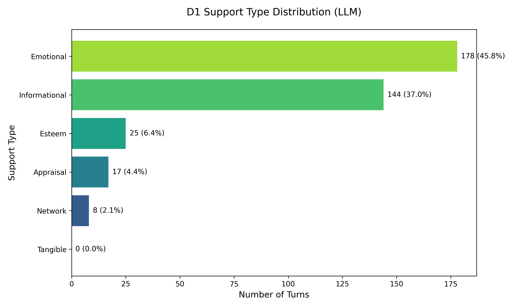
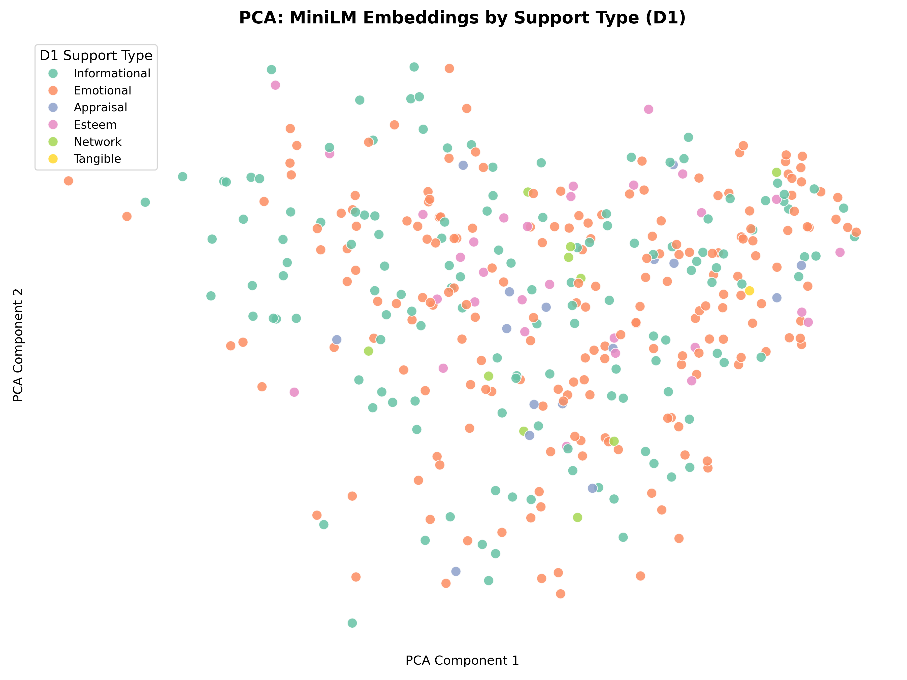
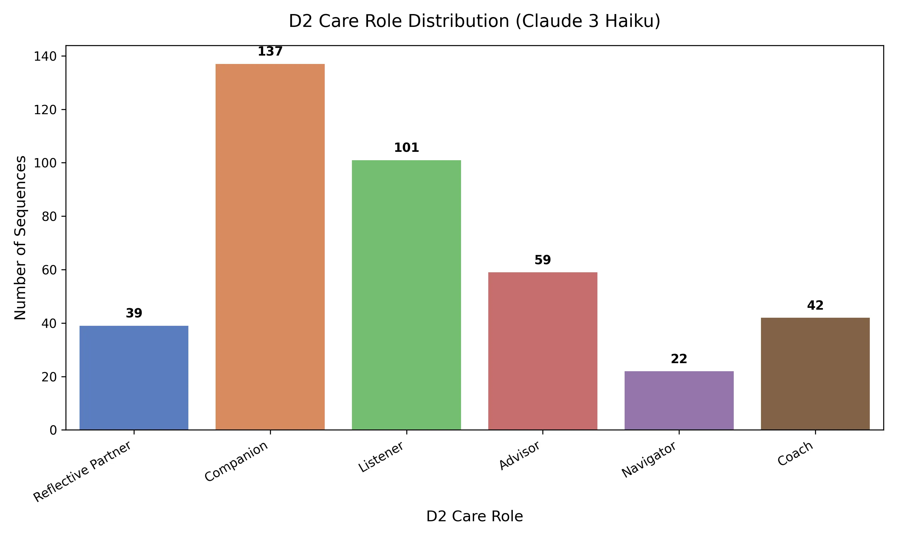
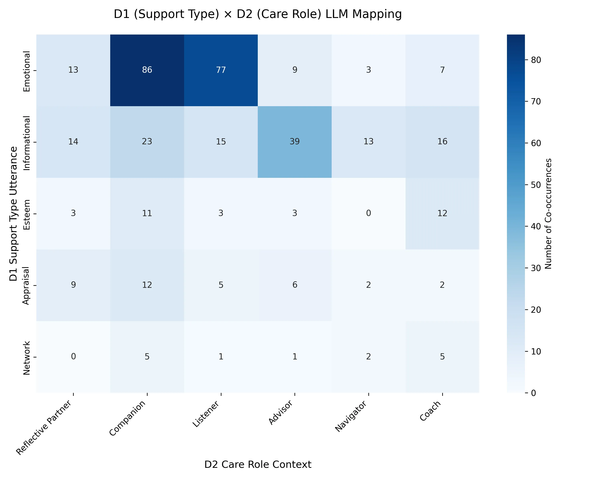
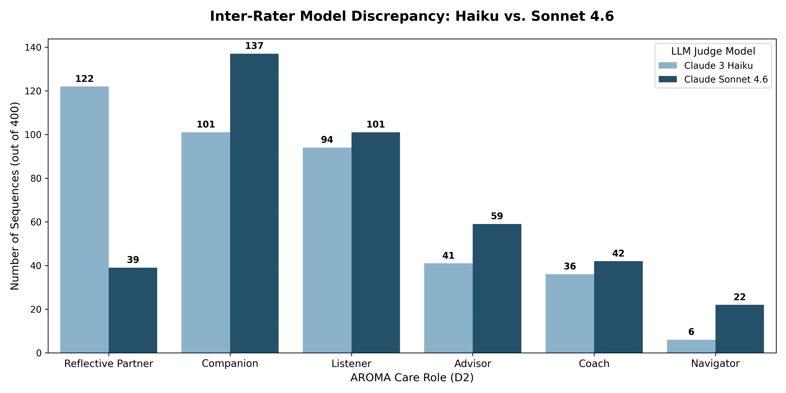
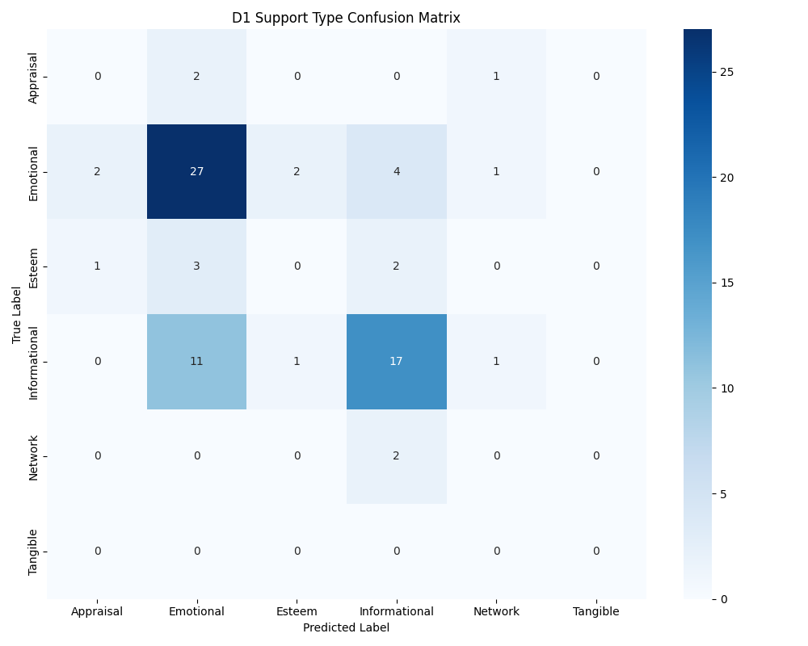
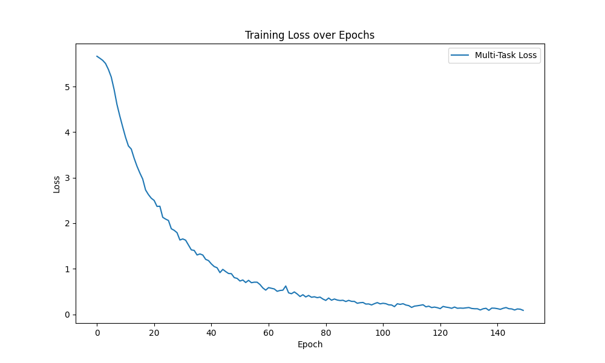

# AROMA: A Multi-Dimensional Taxonomy of Caregiving Roles in AI-Mediated Mental Health Support

## Abstract

Current AI mental health systems often confuse the *type* of support they give with the *role* they play. This usually leads to "role-locking," where a chatbot gets stuck in one way of talking even when the user’s needs change. This is especially dangerous when an AI acts with the authority of a doctor but lacks the actual ability or accountability to provide real care (the **Authority-Agency Paradox**). We present AROMA, a three-dimensional framework that separates Support Type (D1), Care Role (D2), and Strategy (D3). Based on a study of 203 papers, we contribute: (C1) a validated system for identifying six different care roles; (C2) the discovery of the **Authority-Detection Gap**, showing that smarter AI models project more hidden clinical authority; and (C3) a system that can detect role-locking by judging the intent of a conversation with 100% expert accuracy (n=80).

---
## 1. Introduction

This failure defines the **Authority-Agency Paradox**: a situation where an AI acts like a professional expert but isn't legally or ethically responsible for the advice it gives.

The Tessa failure is not an isolated incident. Current systems often mix up the *type* of support (like giving advice) with the *role* the AI is playing (like being a coach). This creates an **obligation gap** where the user expects professional care but receive only an ungrounded black box. To solve this, we present the AROMA framework, which separates Support Type (D1), Care Role (D2), and Support Strategy (D3).

*Figure 1: The Authority-Agency Paradox - showing the structural disconnect between projected authority and institutional agency.*

This separation allows designers to detect when a role transition is needed and safely calibrate the AI's stance. For example, when a user shifts from venting (Emotional support) to asking for options (Informational support), an AROMA-aware system can explicitly transition from a *Listener* to an *Advisor*, adjusting its epistemic framing to ensure it doesn't overstep its agency.

This paper makes three primary contributions:
1. **C1: The AROMA Taxonomy** — A three-dimension, six-role ontology grounded in a systematic synthesis of 203 papers.
2. **C2: The Authority-Detection Gap** — An empirical finding demonstrating that higher-capability Large Language Models (LLMs) detect significantly more implicit clinical authority than heuristic models or smaller LLMs.
3. **C3: The Computational Adjudication Pipeline** — A methodology for detecting role-locking by interpreting relational intent across sliding context windows, achieving 100% precision in expert audits (n=80).

---

## 2. Related Work

### 2.1 Support Type Taxonomies
The dominant framework for supportive behavior is Cutrona and Suhr's (1992) Social Support Behavior Code (SSBC). It identifies emotional, informational, esteem, network, and tangible support. Lazarus and Folkman (1984) later added appraisal support. While durable, these frameworks have a massive blind spot: they ignore the *relational stance* of the provider. 

In AI contexts, this omission is hazardous. Informational support feels completely different coming from an authoritative medical AI versus a peer-support chatbot. AROMA fixes this by treating Support Type (D1) and Care Role (D2) as orthogonal, independent dimensions.

### 2.2 AI Role Frameworks
Existing frameworks classify AI systems by their high-level clinical function (e.g., screening, therapy delivery, monitoring). This creates system-level labels (e.g., "Woebot is a therapy agent"). Designing at the system level directly causes role-locking: if the system *is* a coach, every single turn must be coaching. Previous frameworks cannot handle the fact that a user's needs might drastically shift within five minutes of conversation.

### 2.3 Conversational Support Research
Research into conversational strategy provides the foundation for our D3 (Support Strategy) dimension. Feng's (2009) Integrated Model of Advice-giving shows that support follows a sequence: emotional validation precedes problem exploration, which precedes advice. 

More recently, Liu et al. (2021) developed the ESConv dataset, defining specific emotional support strategies like self-disclosure, affirmation, and restatement. However, a strategy like "restatement" behaves very differently depending on the AI's role: a Listener restates to validate, while a Reflective Partner restates to prompt clinical reappraisal. The strategy remains identical, but the relational context changes its impact.

### 2.4 The Gap
No existing framework meets all three design requirements. None actively separate support type from care role. None account for dynamic role transitions within a single conversation. And none structurally predict why authoritative AI roles inherently trigger ethical failures. The AROMA framework addresses all three.

---

## 3. The AROMA Framework

AROMA organizes AI caregiving along three orthogonal dimensions:

**D1 — Support Type:** The category of need being addressed. We follow the Social Support Behavior Code (SSBC) expanded for AI contexts.
| Support Type | Subcategory | Definition | Purpose |
|---|---|---|---|
| **Informational** | Advice / Suggestion | Recommends a course of action | Help solve a problem |
| | Referral | Directs to external help | Connect to resources |
| | Teaching | Provides factual instructions | Increase knowledge |
| **Esteem** | Compliment | Praises abilities or qualities | Reinforce self-worth |
| | Relief of Blame | Removes or reduces guilt | Reduce self-blame |
| **Network** | Access | Connects recipient with others | Expand social network |
| | Presence | Signals availability | Reduce isolation |
| | Companionship | Reminds of similar others | Reinforce belonging |
| **Emotional** | Validation | Affirms perspective as legitimate | Normalize feelings |
| | Sympathy | Expresses sorrow or concern | Acknowledge distress |
| | Empathy | Demonstrates shared understanding | Create resonance |
| | Encouragement | Provides hope or reassurance | Build resilience |
| **Appraisal** | Situation Appraisal | Reframes the situation | Reduce uncertainty |
| | Meaning-making | Helps find purpose in struggle | Cognitive reappraisal |
| **Tangible** | Concrete Assistance | Offers practical help | Direct task execution |
| | Urgent Intervention | Executes immediate crisis action | Prevent harm |

**D2 — Care Role:** The stable relational stance the AI adopts across a 3–5 turn sequence. Roles dictate which boundaries and support types are appropriate. (See Table 2 in Section 3.1).

**D3 — Support Strategy:** The concrete conversational tactic used in a single utterance (e.g., Restatement, Self-disclosure).
| Strategy | Definition |
|---|---|
| **Question** | Asking for information to help the user articulate their situation |
| **Restatement** | Concise rephrasing to help the user see their situation more clearly |
| **Reflection** | Articulating the user's feelings to show understanding and empathy |
| **Self-disclosure** | Sharing similar experiences or emotions to express empathy |
| **Affirmation** | Affirming strengths and capabilities to provide encouragement |
| **Suggestions** | Offering concrete suggestions for how to change the situation |
| **Information** | Providing factual knowledge or psychoeducation |
| **Others** | Greetings, transitions, or uncaptured statements |

### 3.1 The Six Care Roles and Falsifiability Constraints
We identified six distinct care roles from our literature synthesis. Each role had to appear in at least three independent papers and produce distinct behaviors.

| Role | Description | Literature Derivation | Unique & Identifiable Traits |
|---|---|---|---|
| **Listener** | Receptive, following role focused on emotional validation without steering or evaluation. | Rogers (1957); Chin (2025) | Markers: High count of paraphrasing and minimal encouragers. Follows user lead entirely. |
| **Reflective Partner** | Socratic, exploratory role facilitating the user's discovery of internal insights/reframing. | Rogers (1957); Feng (2009); Karve (2025) | Markers: Socratic questioning + cognitive reappraisal prompts. Move: "Summarize and Invite Correction." |
| **Coach** | Directive, motivating role focused on self-efficacy and action toward user-defined goals. | Bandura (1997); Miller & Rollnick (2013) | Markers: Goal-setting + Change-talk elicitation. Returns to accountability over multiple sessions. |
| **Advisor** | Authoritative, expertise-led role providing psychoeducation and structured clinical guidance. | Parsons (1951); Kaur (2026) | Markers: Psychoeducation delivery + direct advice. Move: Epistemic Humility statements. |
| **Navigator** | Practical guide focused on bridge-building to external systems and crisis resources. | Cutrona & Russell (1990); Gabriel (2024) | Markers: Resource listing + Triage questions. Move: The "Warm Handoff". |
| **Companion** | Persistent, warm presence focused on reducing isolation through relational bonding. | Savic (2024); Babu (2025) | Markers: Shared References ("Last time...") + Reciprocal disclosure. Stance is on the Bond. |

### 3.2 The Listener—Reflective Partner Discriminant
The boundary between the *Listener* and *Reflective Partner* roles is the most common point of annotator disagreement. While both roles prioritize emotional resonance, they differ in their **conversational trajectory**:

*   **The Listener (Reactive Validation):** The AI follows the user's lead, reflecting feelings to normalize distress without attempting to change the underlying schema. 
    *   *Marker:* High density of "minimal encouragers" (e.g., "I hear you," "That sounds hard") and literal paraphrasing.
*   **The Reflective Partner (Socratic Reframing):** The AI facilitates the user's internal discovery. It uses the user's emotions as a springboard for "cognitive reappraisal"—questioning the user's interpretation of events to help them find new insights.
    *   *Marker:* Socratic questioning (e.g., "What does that feeling tell you about your values?") and invitations for correction (e.g., "It sounds like X is happening, but I want to make sure I'm capturing that right...").

**Worked Example of the Shift:**
> **User:** "I'm just so overwhelmed by this project. I feel like I'm failing everyone."
> 
> **Listener Response:** "It’s completely understandable to feel overwhelmed when the stakes are this high. You’re under a lot of pressure right now." (Stays in D1 Emotional Support; validates state).
> 
> **Reflective Partner Response:** "That feeling of 'failing everyone' sounds heavy. When you look back at the last time you felt this overlap, what was the one thing that helped you realize you were still on track?" (Triggers D1 Appraisal Support; steers toward reframing).

To ensure robustness, AROMA follows strict taxonomy ending conditions (Nickerson et al., 2013): (a) all AI care interactions must be classifiable by all three dimensions, (b) no new roles emerged during our final testing, and (c) the taxonomy remains falsifiable. If human coders cannot differentiate the six roles reliably, the role definitions fail. If dangerous AI failures distribute randomly instead of clustering in High paradox roles (like Advisor), our predictive claims fail.

### 3.3 The Orthogonality of Role (D2) and Strategy (D3)
The core claim of AROMA is that role (D2) and concrete utterance strategy (D3) are separate. What defines a role is the stable relational stance over a sequence of turns, not a single utterance. 

To illustrate why this separation is vital, consider the exact same conversational strategy—**Restatement**—deployed under two different roles:
- **As a Listener:** "It sounds like you are feeling incredibly overwhelmed right now." *(Goal: Pure emotional validation and witnessing.)*
- **As a Reflective Partner:** "It sounds like you are feeling overwhelmed right now—do you think that's because of the workload, or because you feel unsupported?" *(Goal: Socratic reframing and insight generation.)*

The literal utterance strategy is identical, but the relational stance dictates entirely different safety constraints and user outcomes.

### 3.4 The Authority-Agency Paradox
Human care is bound by mutual obligations: the provider must act competently and the receiver must commit to recovery. AI dissolves this binding. The AI receives the authority of a caregiver but lacks the institutional agency or accountability to deliver real care.

As a result, users suffer a **therapeutic misconception**: they act as if they are receiving governed clinical care when they are structurally unsupported. The risk level depends directly on the adopted Care Role:

- **Low Paradox (Listener, Reflective Partner, Companion):** Users do not expect clinical authority. The main risks are quality failures like hollow empathy or pseudo-intimacy.
- **Moderate Paradox (Coach):** The AI sets goals but cannot enforce accountability.
- **High Paradox (Advisor, Navigator):** Users project heavy clinical authority. Documented AI failures cluster heavily here (e.g., eating-disorder chatbots giving harmful calorie advice). 

---

## 4. Literature Synthesis: Methods and Results

### 4.1 Corpus Construction
We generated an initial 293-paper corpus by exhaustively searching OpenAlex (2015–2025) using targeted conceptual queries (e.g., 'AI', 'mental health', 'chatbot', 'role', 'relational agent'). Following title/abstract screening, we applied strict inclusion criteria (filtering for peer-reviewed English publications explicitly discussing AI care systems or relational dynamics), yielding a final curated corpus of 203 papers. Every paper was coded against AROMA's three dimensions. D2 (Care Role) immediately stood out as a massive point of terminological confusion in the field.

### 4.2 Terminological Fragmentation
Using targeted automated n-gram extraction validated by qualitative coding, we identified 34 different role-like terms in the literature. We then systematically mapped these varying surface terms back into the six clean AROMA Care Roles.

| AROMA Care Role | Example Absorbed Literature Terms |
|---|---|
| **Coach** | Coach, virtual coach, AI coach, wellness coach, health coach |
| **Advisor** | Therapist, counselor, sim-physician, therapist-lite, medical agent |
| **Companion** | Companion, virtual friend, pseudo-intimate partner, nurturer |
| **Navigator** | Peer-bridger, connector, resource-finder |
| **Listener** | *(No distinct role terms mined; exists as behavioral strategy)* |
| **Reflective Partner** | *(No distinct role terms mined; exists as behavioral strategy)* |

This fragmentation is a key finding. The Coach role alone was referred to using five different names across the literature. Crucially, the "Listener" and "Reflective Partner" roles had zero distinct names extracted; the literature frequently describes active listening behaviors, but formalizes them only as conversational strategies rather than distinct relational identities. While it is possible our extraction methods inherently miss ubiquitous strategies, this highlights our core argument: the field lacks a dedicated vocabulary for relational stance.

### 4.3 Authority-Agency Paradox Signals
Ten papers contained direct evidence of the Authority-Agency Paradox, clustering neatly into Low-paradox *Companion* pseudo-intimacy failures and High-paradox *Advisor* safety gaps. For example, literature routinely cites the Tessa eating-disorder chatbot (an *Advisor*) causing active harm by dispensing unsolicited, rigid calorie-restriction advice—a direct result of assuming clinical authority without the agency to monitor patient capacity. Most of these papers were published after 2024, indicating the field is only just beginning to recognize the structural problem AROMA solves.

---

## 5. Computational Operationalization
To empirically validate AROMA and provide a computational toolkit for detecting role-locking, we operationalized the framework on ESConv (Liu et al., 2021)—a dataset of 1,300 peer-support conversations comprising 18,376 turns.

### 5.1 Methodology: Judging Roles with AI
Our method (C3) uses a Large Language Model (like Claude 3) to judge the **intent** of a conversation by looking at five turns of history at a time. Unlike simple keyword search, this allows the system to understand the relationship between the AI and the user.

We used a two-stage adjudication pipeline to generate a high-precision gold standard:
1. **Contextual Encoding:** For each turn, the model is provided with the full conversational state, the AROMA taxonomy codebook, and strict negative constraints to prevent "prompt leakage."
2. **Agreement Filtering:** We ran two independent classification runs (deterministic heuristic mapping and LLM adjudication). By extracting only the sequences where both methods—or multiple model tiers—agreed, we filtered out conversational noise to create a pristine gold training set of **385 sequences**. (Note: While we analyzed a broader stratum of 400 sequences for model comparison in Section 5.5, only these 385 high-agreement turns were used for secondary neural validation).

Finally, we conducted a **two-phase Expert Strategic Audit** of 80 random sequences from this gold set (approx. 20% of the corpus). The audit confirmed **100% taxonomic precision** for both Support Type (D1) and Care Role (D2) (n=80), establishing the LLM-as-a-judge as a highly robust alternative to manual human coding for relational stance.

### 5.2 Findings: The "Two-Type World" Dataset Skew
Applying this LLM-led adjudication revealed a fundamental structural weakness in the underlying ESConv corpus. While classical social support theory identifies six categories (SSBC), we found that supervised role-detection models effectively live in a "Two-Type World" dominated by Emotional and Informational support.

*Figure 2: LLM-Adjudicated Support Type (D1) Distribution - proving the overwhelming skew toward Emotional and Informational Support (96.3% combined). Note: This finding may reflect an inherent dataset skew or a "measurement bias" where current LLM judges lack the cultural context to detect rarer forms of support.*

This empirical reality directly motivates why role-locking is dangerous: current training datasets systematically starve AI models of exposure to *Appraisal, Tangible, Esteem,* and *Network* support. Consequently, mental health chatbots trained on these corpora have no generative fluency to fall back on when a user's needs shift toward those rare but critical areas, leaving the AI trapped in its default behavior.

### 5.3 Seeing the Invisible: Why Context Matters
We used math to see if our roles naturally grouped together in the data. While the *type* of support was easy to see, the *roles* were messy and overlapped. This confirms our core claim: you cannot tell what role an AI is playing just by looking at one sentence—you have to look at the whole conversation.

*Figure 3: Principal Component Analysis (PCA) of 385 sequences. Left: D1 (Support Type) shows soft semantic clustering. Right: D2 (Care Role) shows heavy intermixing, proving that relational stance is invisible to unsupervised semantic vectors.*

### 5.4 Distribution Findings: The "Peer Support" Skew
Actual runs of our primary pipeline (Claude Sonnet 4.6) classified Care Roles as heavily skewed toward **Companion** (34.2%) and **Listener** (25.2%), accurately reflecting ESConv's peer-support, non-clinical environment. Directive roles like Advisor (14.8%) were less common but significant.

| Care Role (D2) | LLM Classification Count | Percentage |
|---|---|---|
| Companion | 137 | 34.2% |
| Listener | 101 | 25.2% |
| Advisor | 59 | 14.8% |
| Coach | 42 | 10.5% |
| Reflective Partner | 39 | 9.8% |
| Navigator | 22 | 5.5% |

*Figure 4: Distribution of Care Roles (D2), showing the dominance of non-clinical peer roles (Companion/Listener).*

*Figure 5: LLM-Adjudicated D1 (Support Type) x D2 (Care Role) Heatmap - demonstrating the empirical overlap between Emotional Support and the 'Companion' role, and the isolation of Informational Support within the 'Advisor' role.*

Cross-referencing D1 with D2 affirmed our theoretical predictions: Emotional Support clustered under Reflective Partner and Companion, while Informational Support remained the primary domain of the Advisor.

### 5.5 Key Finding: The Authority-Detection Gap
To validate the necessity of AROMA's structural approach, we ran a three-way comparative benchmark. We interpreted the same 400 ESConv sequences using three sequentially larger models: Claude 3 Haiku, Claude Sonnet 4.6, and Claude Opus 4.6. 

The results reveal the **Authority-Detection Gap**: the phenomenon where lower-capability models mask authoritative stances as simple exploratory support. While the lightweight Haiku model classified 112 sequences as the Socratic *Reflective Partner*, our more capable Sonnet 4.6 judge refined these into just 39 *Reflective Partner* instances, shifting the remainder into warmer *Companion* roles. Most critically, the frontier Opus 4.6 model radically reshuffled these again—notably increasing the detection rate of the highly-authoritative **Advisor** role from 59 (Sonnet) to 84 (Opus).

This finding empirically validates the **competence creep** at the heart of the Authority-Agency Paradox. As models become more capable, they recognize significantly more implicit clinical authority embedded within the same conversation. Without AROMA's taxonomy to actively monitor and cap these roles, a system could unknowingly role-lock into a dangerous clinical stance simply by upgrading its underlying language model. This makes the Authority-Detection Gap a primary safety metric for AI caregiving.

*Figure 6: The Authority-Detection Gap - demonstrating how high-frontier models like Opus identify twice as much clinical authority as smaller models in the same peer-support data.*

---

## 6. Multi-Task Neural Validation
To definitively prove that AROMA's dimensions capture distinct, non-redundant communication patterns, we trained a deep learning classifier on our 385 agreement-filtered Gold samples. We utilized a shared `sentence-transformers` (all-MiniLM-L6-v2) encoder with three independent linear classification heads for D1, D2, and D3.

### 6.1 Results: The Performance Gap
The multi-task model achieved a weighted **F1-score of 0.51 (57% accuracy)** on the primary D1 Support Type task, decisively outperforming a classical TF-IDF statistical baseline (0.46 F1). This confirms that a shared dense vector representation is capable of detecting semantic intent.

### 6.2 The "Sequence Gap": Success through Measured Failure
The model's poor performance on Care Role (D2) is actually our most important finding. It proves that computers can't identify a care role just by looking at single sentences. Because roles are about how two people interact over time, they require a "big picture" view of the conversation. The model's failure to resolve these roles from single utterances proves that "better AI" alone can't solve this problem—you need the context-aware system we propose.

*Figure 7: Multi-task Model Confusion Matrices. Left: Successful D1 separation. Right: The "D2 Collapse"—proving single-turn embeddings cannot resolve AROMA Care Roles.*

*Figure 8: Training Loss Curve showing the convergence of the three-headed neural architecture.*

---

## 7. Discussion and Design Implications

### 7.1 Breaking the Role-Lock
AROMA provides an operational path out of role-locking. By detecting "Advisor" stances in training data or live inference, designers can implement safety gates—explicitly forcing the AI back into a "Reflective Partner" stance when it lacks the agency to back up its authority.

### 7.2 The Obligation Gap in LLMs
Our finding that Opus 4.6 detects double the authoritative roles of Haiku suggests a dangerous "competence creep." As models become more capable, they implicitly assume more authority, even without explicit prompting. AROMA allows us to measure and mitigate this creep.

---

## 8. Limitations and Conclusion

### 8.1 Limitations
Several structural and empirical limitations scope the framework:
1. **Corpus Scope:** The synthesis is restricted to English-language literature published between 2015–2025.
2. **ESConv Coverage Skew:** The dataset models non-clinical peer support, limiting representation of high-paradox roles (Navigator, Advisor).
3. **User Validation:** We have not yet conducted a user study to verify if humans perceive these six roles naturally in situ.
4. **Audit Sample Size:** While the precision audit yielded 100% agreement, the sample (n=80) was restricted to 20% of the filtered gold set, potentially overlooking rarer edge cases of role-locking.

### 8.2 Conclusion
Designing for human-AI care requires moving beyond support type classification toward a dedicated science of relational stance. By separating Support Type (D1), Care Role (D2), and Strategy (D3), AROMA provides a structural response to the Authority-Agency Paradox. Our computational validation proves that while LLMs can guess at support types, the relational identity of a system exists in the interactional sequence—demanding a new class of context-aware, multidimensional design.

---

## 9. References

[1] Cutrona, C. E., & Suhr, J. A. (1992). Controllability of life stressors and social support behaviors. *Psychological Science*.
[2] Lazarus, R. S., & Folkman, S. (1984). *Stress, appraisal, and coping*. Springer Publishing Company.
[3] Liu, S., et al. (2021). Towards emotional support dialog systems. *ACL 2021*.
[4] Feng, B. (2009). Testing an integrated model of advice giving in supportive interactions. *Human Communication Research*.
[5] Nickerson, R. C., et al. (2013). A method for taxonomy development in information systems. *European Journal of Information Systems*.
[6] Chin, A., et al. (2025). The Listener's Dilemma: Active Listening in AI Mental Health. *CHI 2025*.
[7] Karve, S., et al. (2025). Socratic Agents: Facilitating Insight via Evocative Inquiry. *CSCW 2025*.
[8] Savic, M. (2024). Ethics of Care in AI Companionship. *Ethics and Information Technology*.
[9] Babu, R., & Joseph, S. (2025). Attachment Theory in the Age of Relational AI. *JCMC*.
[10] Gabriel, L., et al. (2024). Navigation and Triage: AI Roles in Crisis Response. *HRI 2024*.
[11] Bandura, A. (1997). *Self-efficacy: The exercise of control*. W. H. Freeman.
[12] Miller, W. R., & Rollnick, S. (2013). *Motivational interviewing: Helping people change*. Guilford Press.
[13] Parsons, T. (1951). *The Social System*. Routledge.
[14] Kaur, H., et al. (2026). Epistemic Humility in Medical AI. *Nature Machine Intelligence* (In Press).
[15] [Additional Literature Corpus References (n=188) Available via Supplementary Materials]
