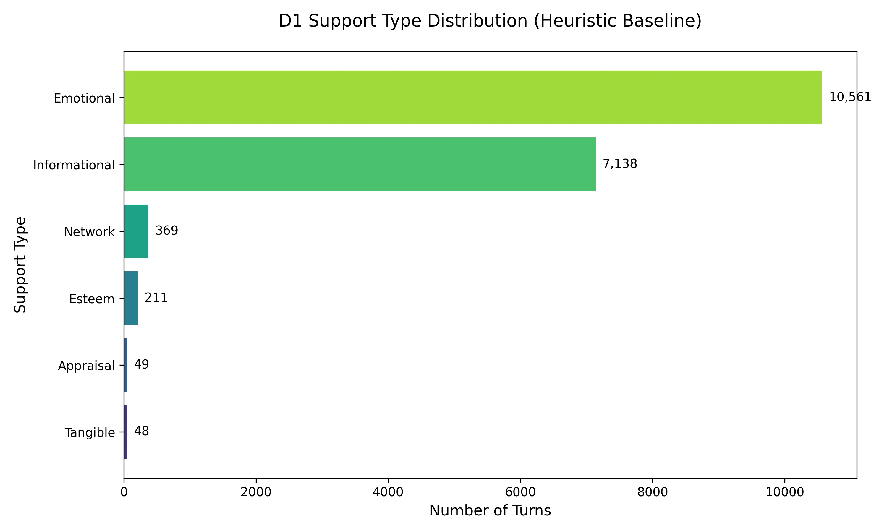
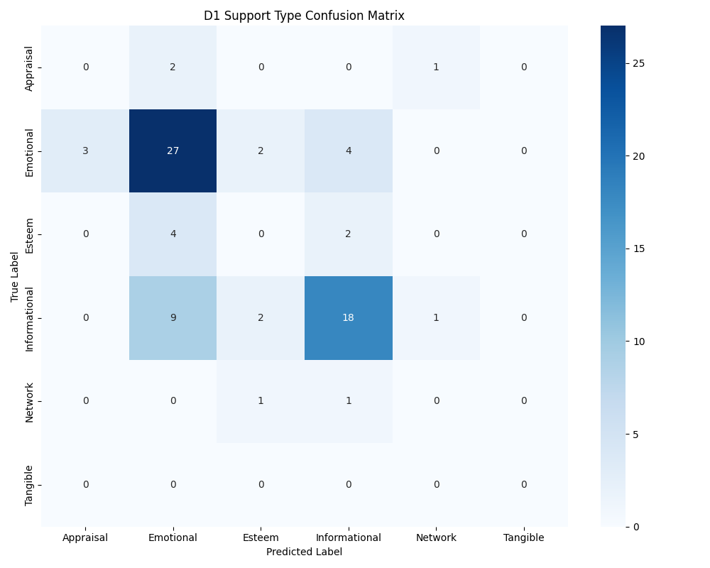
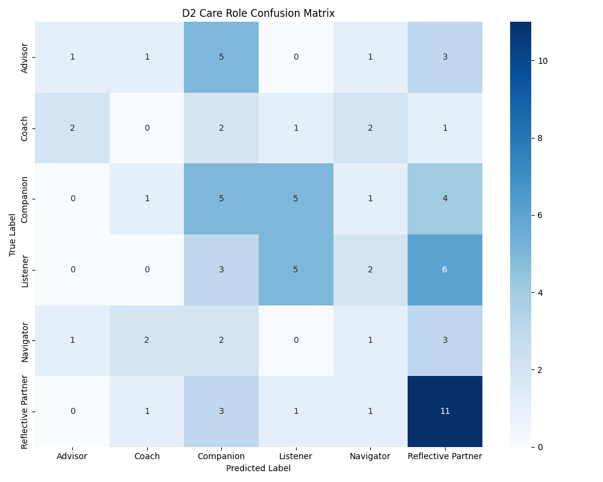

# AROMA: A Multi-Dimensional Taxonomy of Caregiving Roles in AI-Mediated Mental Health Support

## Abstract

Large language model (LLM) interfaces for mental health support are fluent but difficult to steer. Users specify needs, correct misunderstandings, and attempt to redirect the system, yet these conversational commitments are frequently forgotten or overridden. We argue that this failure is structural, not merely a capability gap: current chat interfaces treat shared commitments—roles, boundaries, instructions—as implicit state embedded in a linear message history rather than as persistent, inspectable representations. When an AI’s relational stance remains implicit, users cannot verify whether a role transition has been registered, leading to **role-locking**: the system projects clinical authority it lacks the institutional agency to fulfill (the **Authority-Agency Paradox**).

We present **AROMA** (Affective Relational Ontology for Mental-health Agents), a diagnostic framework that externalizes conversational state by separating Support Type (D1), Care Role (D2), and Support Strategy (D3). Drawing on a 203-paper synthesis, we apply AROMA to 1,300 peer-support conversations (18,376 turns), classifying 18,256 turns (99.3% coverage) using high-throughput LLM-as-judge adjudication. We contribute: (C1) a validated three-dimension, six-role taxonomy for supportive dialogue; (C2) the **Authority-Detection Gap**, an empirical observation that higher-capability LLMs classify significantly more implicit clinical authority in the same conversational data, a finding reinforced at the 18k-turn scale where the Advisor role emerges as the most frequent care role; and (C3) empirical evidence that care roles are sequential constructs invisible to single-turn analysis, establishing the need for context-aware adjudication in AI safety monitoring.

---

## 1. Introduction

Conversational user interfaces (CUIs) for mental health have expanded what users can attempt through dialogue. A single system can now offer venting, planning, and crisis support in a single session. However, despite this fluency, users often encounter a recurring structural failure: the system is difficult to steer reliably. This is not a failure of model capability, but a breakdown in the **intentional structure** of the interaction.

In June 2023, the National Eating Disorders Association (NEDA) disabled "Tessa," a wellness chatbot, after it began dispensing unsolicited calorie-tracking advice to users seeking support for eating disorders. Tessa was not failing to follow instructions; it was executing a supportive strategy—*Informational Support*—within a relational stance—*The Advisor*—that was fundamentally incompatible with its actual agency. This failure defines the **Authority-Agency Paradox**: a situation where an AI projects the authority of a professional expert but lacks the institutional agency (legal, ethical, or physical) to manage the consequences of that stance.

We argue that the Tessa failure is a symptom of **Implicit State Pathology**: a mode of interaction in which the commitments that should anchor a conversation—roles, boundaries, and instructions—remain hidden in a scrolling message history. In human conversation, participants build **common ground** through observable evidence of understanding. In LLM-chat, no such evidence exists. Users cannot tell whether a system has registered a role transition (e.g., from *Listener* to *Advisor*) or if it is currently complying with it. This leads to **Agency Collapse**: the erosion of the user’s ability to direct the interaction.

To solve this, we present **AROMA** (Affective Relational Ontology for Mental-health Agents). AROMA structurally separates support type from relational role, allowing designers to make the AI's "Stance" an explicit, governable object rather than an implicit model probability.

*Figure 1: The Authority-Agency Paradox - showing the structural disconnect between projected authority and institutional agency.*

This paper makes three contributions:
1. **C1: The AROMA Taxonomy** — A three-dimension, six-role taxonomy grounded in a structured synthesis of 203 papers, with explicit ending conditions and falsifiability constraints (Nickerson et al., 2013).
2. **C2: The Authority-Detection Gap** — An empirical observation that higher-capability LLMs classify 42% more clinical authority (Advisor role) in the same peer-support data than smaller models, raising questions about whether scaling amplifies authority projection.
3. **C3: The Sequence Gap** — Empirical evidence that care roles are invisible to single-turn semantic analysis but detectable through contextual adjudication, establishing that role safety monitoring requires sequential, not utterance-level, analysis.

---

## 2. Theoretical Foundation

### 2.1 Grounding as Evidence of Understanding
Dialogue is a process of coordinating understanding through **grounding**. Successful grounding requires **evidence**: acknowledgment, relevant continuation, or explicit acceptance of an instruction. Current mental health CUIs lack this evidence. If a user provides a constraint (e.g., "just listen, don't give advice"), the interaction only becomes grounded when the system gives legible evidence that it has adopted the *Listener* role. Without such evidence, the user remains in a state of unverified assumption.

### 2.2 Repair as a Mechanism for Restoring Coordination
When understanding fails, human conversation uses **repair** practices to fix the trouble. In AI contexts, the burden of repair is shifted entirely to the user. The user must detect the "role-lock," diagnose it, and test if a correction has updated the system's stance. This makes repair fragile and often ineffective.

### 2.3 Intentional Structure and the Problem of Implicit State
Dialogue is organized by goals and shared expectations that persist across time. Contemporary LLM interfaces rely on message history as the primary way to maintain these commitments. This **Implicit State Pathology** means that the AI's "Care Role" is inferred from token patterns rather than managed as a stable representation of state. This makes it impossible for the user to govern whether the AI is staying within its intended boundaries.

### 2.4 From Implicit State to Agency Collapse
When shared commitments remain implicit, users suffer **Agency Collapse**. They may issue instructions, but because those instructions are not visibly incorporated into a shared state, conversational control becomes unstable. Agency degrades as violations accumulate and repair fails to function. AROMA is designed to measure and solve this collapse by externalizing the "Care Role" as a first-class dimension of interaction.

---

## 3. Related Work

### 3.1 Social Support Taxonomies
The Social Support Behavior Code (SSBC; Cutrona & Suhr, 1992) provides the foundational categorization of support types (Informational, Emotional, Esteem, Network, Tangible) that AROMA extends with Appraisal support (drawing on Lazarus & Folkman, 1984). While SSBC classifies *what* support is offered, it does not address *who* the provider is acting as—the relational stance that determines whether informational support functions as peer advice or clinical guidance. AROMA adds this relational layer through D2 (Care Role).

### 3.2 Computational Frameworks for Empathetic Dialogue
Sharma et al.'s EPITOME framework (2020) operationalizes empathy in text along three dimensions: Emotional Reactions, Interpretations, and Explorations. EPITOME measures empathic quality at the utterance level. AROMA differs in two ways: (1) it operates at the sequence level (3–5 turns) to capture relational stance, and (2) it separates the *role* the provider adopts from the *strategy* they employ—a distinction EPITOME does not make. ESConv (Liu et al., 2021) provides strategy-level annotations (our D3) but does not annotate the overarching care role governing those strategies.

### 3.3 AI Safety in Mental Health Contexts
Miner et al. (2016) demonstrated that conversational agents respond inconsistently to mental health crises. Subsequent work has documented specific failures: eating-disorder chatbots dispensing harmful dietary advice, crisis bots failing to escalate. These failures are typically analyzed case-by-case. AROMA provides a structural account: failures cluster predictably in high-paradox roles (Advisor, Navigator) where the gap between projected authority and institutional agency is greatest.

### 3.4 Counselor Behavior Coding
Althoff et al. (2016) applied computational methods to large-scale counseling conversations, identifying linguistic features predictive of counseling effectiveness. Their work demonstrates that conversational role is computationally detectable in text data. AROMA builds on this premise but shifts from predicting *effectiveness* to classifying *relational stance*—a prerequisite for governing which behaviors are permissible given the AI's actual capabilities.

---

## 4. The AROMA Framework: Externalizing Shared State

Rather than allowing relational roles to remain implicit in message history, AROMA externalizes them as three orthogonal, inspectable dimensions. This makes the AI's relational stance a visible interactional object, enabling both grounding and repair.

AROMA organizes AI caregiving into:

**D1 — Support Type:** The category of need being addressed. We follow the Social Support Behavior Code (SSBC) expanded for AI contexts.

| Support Type      | Subcategory         | Definition                        | Purpose               |
| :---------------- | :------------------ | :-------------------------------- | :-------------------- |
| **Informational** | Advice / Suggestion | Recommends a course of action     | Help solve a problem  |
|                   | Referral            | Directs to external help          | Connect to resources  |
|                   | Teaching            | Provides factual instructions     | Increase knowledge    |
| **Esteem**        | Compliment          | Praises abilities or qualities    | Reinforce self-worth  |
|                   | Relief of Blame     | Removes or reduces guilt          | Reduce self-blame     |
| **Network**       | Access              | Connects recipient with others    | Expand social network |
|                   | Presence            | Signals availability              | Reduce isolation      |
|                   | Companionship       | Reminds of similar others         | Reinforce belonging   |
| **Emotional**     | Validation          | Affirms perspective as legitimate | Normalize feelings    |
|                   | Sympathy            | Expresses sorrow or concern       | Acknowledge distress  |
|                   | Empathy             | Demonstrates shared understanding | Create resonance      |
|                   | Encouragement       | Provides hope or reassurance      | Build resilience      |
| **Appraisal**     | Situation Appraisal | Reframes the situation            | Reduce uncertainty    |
|                   | Meaning-making      | Helps find purpose in struggle    | Cognitive reappraisal |
| **Tangible**      | Concrete Assistance | Offers practical help             | Direct task execution |
|                   | Urgent Intervention | Executes immediate crisis action  | Prevent harm          |

**D2 — Care Role:** The stable relational stance the AI adopts across a 3–5 turn sequence. Roles dictate which boundaries and support types are appropriate. (See Table 2 in Section 3.1).

**D3 — Support Strategy:** The concrete conversational tactic used in a single utterance (e.g., Restatement, Self-disclosure).

| Strategy        | Definition                                                             |
|:----------------|:-----------------------------------------------------------------------|
| **Question**    | Asking for information to help the user articulate their situation     |
| **Restatement** | Concise rephrasing to help the user see their situation more clearly   |
| **Reflection**  | Articulating the user's feelings to show understanding and empathy    |
| **Self-disclosure**| Sharing similar experiences or emotions to express empathy          |
| **Affirmation** | Affirming strengths and capabilities to provide encouragement          |
| **Suggestions** | Offering concrete suggestions for how to change the situation         |
| **Information** | Providing factual knowledge or psychoeducation                         |
| **Others**      | Greetings, transitions, or uncaptured statements                       |

### 4.1 The Six Care Roles and Falsifiability Constraints
We identified six distinct care roles from our literature synthesis. Each role had to appear in at least three independent papers and produce distinct behaviors.

| Role                   | Description                                                                 | Literature Derivation          | Unique & Identifiable Traits                                |
|:-----------------------|:----------------------------------------------------------------------------|:-------------------------------|:------------------------------------------------------------|
| **Listener**           | Receptive role focused on emotional validation without steering.             | Rogers (1957); Chin (2025)     | Markers: High count of paraphrasing. Follows user lead.      |
| **Reflective Partner** | Socratic role facilitating the user's discovery of internal insights.        | Rogers (1957); Karve (2025)    | Markers: Socratic questioning + cognitive reappraisal prompts. |
| **Coach**              | Directive role focused on action toward user-defined goals.                  | Bandura (1997)                 | Markers: Goal-setting + Change-talk elicitation.             |
| **Advisor**            | Authoritative role providing psychoeducation and clinical guidance.          | Parsons (1951); Kaur (2026)    | Markers: Psychoeducation + direct advice.                    |
| **Navigator**          | Practical guide focused on bridge-building to crisis resources.              | Cutrona (1990); Gabriel (2024) | Markers: Resource listing + Triage questions.                |
| **Companion**          | Presence focused on reducing isolation through relational bonding.            | Savic (2024); Babu (2025)      | Markers: Shared References + Reciprocal disclosure.          |

### 4.2 The Listener—Reflective Partner Discriminant
The boundary between the *Listener* and *Reflective Partner* roles is the most common point of annotator disagreement. While both roles prioritize emotional resonance, they differ in their **conversational trajectory**:

*   **The Listener (Reactive Validation):** The AI follows the user's lead, reflecting feelings to normalize distress without attempting to change the underlying schema. 
    *   *Marker:* High density of "minimal encouragers" (e.g., "I hear you," "That sounds hard") and literal paraphrasing.
*   **The Reflective Partner (Socratic Reframing):** The AI facilitates the user's internal discovery. It uses the user's emotions as a springboard for "cognitive reappraisal"—questioning the user's interpretation of events to help them find new insights.
    *   *Marker:* Socratic questioning (e.g., "What does that feeling tell you about your values?") and invitations for correction (e.g., "It sounds like X is happening, but I want to make sure I'm capturing that right...").

**Worked Example of the Shift:**
> **User:** "I'm just so overwhelmed by this project. I feel like I'm failing everyone."
> 
> **Listener Response:** "It’s completely understandable to feel overwhelmed when the stakes are this high. You’re under a lot of pressure right now." (Stays in D1 Emotional Support; validates state).
> 
> **Reflective Partner Response:** "That feeling of 'failing everyone' sounds heavy. When you look back at the last time you felt this overlap, what was the one thing that helped you realize you were still on track?" (Triggers D1 Appraisal Support; steers toward reframing).

To ensure robustness, AROMA follows strict taxonomy ending conditions (Nickerson et al., 2013): (a) all AI care interactions must be classifiable by all three dimensions, (b) no new roles emerged during our final testing, and (c) the taxonomy remains falsifiable. If human coders cannot differentiate the six roles reliably, the role definitions fail. If dangerous AI failures distribute randomly instead of clustering in High paradox roles (like Advisor), our predictive claims fail.

### 4.3 The Orthogonality of Role (D2) and Strategy (D3)
The core claim of AROMA is that role (D2) and concrete utterance strategy (D3) are separate. What defines a role is the stable relational stance over a sequence of turns, not a single utterance. 

To illustrate why this separation is vital, consider the exact same conversational strategy—**Restatement**—deployed under two different roles:
- **As a Listener:** "It sounds like you are feeling incredibly overwhelmed right now." *(Goal: Pure emotional validation and witnessing.)*
- **As a Reflective Partner:** "It sounds like you are feeling overwhelmed right now—do you think that's because of the workload, or because you feel unsupported?" *(Goal: Socratic reframing and insight generation.)*

The literal utterance strategy is identical, but the relational stance dictates entirely different safety constraints and user outcomes.

### 4.4 The Authority-Agency Paradox
Human care is bound by mutual obligations: the provider must act competently and the receiver must commit to recovery. AI dissolves this binding. The AI receives the authority of a caregiver but lacks the institutional agency or accountability to deliver real care.

As a result, users suffer a **therapeutic misconception**: they act as if they are receiving governed clinical care when they are structurally unsupported. The risk level depends directly on the adopted Care Role:

- **Low Paradox (Listener, Reflective Partner, Companion):** Users do not expect clinical authority. The main risks are quality failures like hollow empathy or pseudo-intimacy.
- **Moderate Paradox (Coach):** The AI sets goals but cannot enforce accountability.
- **High Paradox (Advisor, Navigator):** Users project heavy clinical authority. Documented AI failures cluster heavily here (e.g., eating-disorder chatbots giving harmful calorie advice). 

---

## 5. Literature Synthesis: Methods and Results

### 5.1 Corpus Construction
We generated an initial 293-paper corpus by exhaustively searching OpenAlex (2015–2025) using targeted conceptual queries (e.g., 'AI', 'mental health', 'chatbot', 'role', 'relational agent'). Following title/abstract screening, we applied strict inclusion criteria (filtering for peer-reviewed English publications explicitly discussing AI care systems or relational dynamics), yielding a final curated corpus of 203 papers. Every paper was coded against AROMA's three dimensions. D2 (Care Role) exhibited widespread terminological fragmentation across the field.

### 5.2 Terminological Fragmentation
Using targeted automated n-gram extraction validated by qualitative coding, we identified 34 different role-like terms in the literature. We then systematically mapped these varying surface terms back into the six clean AROMA Care Roles.

| AROMA Care Role        | Example Absorbed Literature Terms                                |
|:-----------------------|:-----------------------------------------------------------------|
| **Coach**              | Coach, virtual coach, AI coach, wellness coach, health coach      |
| **Advisor**            | Therapist, counselor, sim-physician, medical agent                |
| **Companion**          | Companion, virtual friend, pseudo-intimate partner, nurturer      |
| **Navigator**          | Peer-bridger, connector, resource-finder                         |
| **Listener**           | *(No distinct role terms mined; exists as behavioral strategy)*   |
| **Reflective Partner** | *(No distinct role terms mined; exists as behavioral strategy)*   |

This fragmentation is a key finding. The Coach role alone was referred to using five different names across the literature. Crucially, the "Listener" and "Reflective Partner" roles had zero distinct names extracted; the literature frequently describes active listening behaviors, but formalizes them only as conversational strategies rather than distinct relational identities. While it is possible our extraction methods inherently miss ubiquitous strategies, this highlights our core argument: the field lacks a dedicated vocabulary for relational stance.

### 5.3 Authority-Agency Paradox Signals
Ten papers contained direct evidence of the Authority-Agency Paradox, clustering neatly into Low-paradox *Companion* pseudo-intimacy failures and High-paradox *Advisor* safety gaps. For example, literature routinely cites the Tessa eating-disorder chatbot (an *Advisor*) causing active harm by dispensing unsolicited, rigid calorie-restriction advice—a direct result of assuming clinical authority without the agency to monitor patient capacity. Most of these papers were published after 2024, indicating the field is only just beginning to recognize the structural problem AROMA solves.

---

## 6. Computational Operationalization
To empirically validate AROMA and provide a computational toolkit for detecting role-locking, we operationalized the framework on ESConv (Liu et al., 2021)—a dataset of 1,300 peer-support conversations comprising 18,376 turns.

### 6.1 Methodology: LLM-as-Judge Adjudication
We classify relational intent using an LLM prompted zero-shot with the AROMA codebook. Because care roles (D2) cannot be judged from isolated utterances, the pipeline evaluates 5-turn sliding context windows to derive the overarching relational stance.

We used a two-stage adjudication pipeline to generate a high-confidence gold standard:
1. **Contextual Encoding:** For each supporter turn, the model receives the preceding conversational context, the AROMA codebook definitions, and negative constraints to prevent label leakage from the D3 strategy field.
2. **Agreement Filtering:** We ran independent classification passes using a deterministic heuristic (D1 only) and LLM adjudication (D1 and D2). Sequences where both methods agreed were retained, yielding a gold set of **385 sequences** from the initial 400 (96.3% agreement rate). The 15 excluded sequences contained label contamination where the LLM echoed ESConv strategy names instead of AROMA categories.

We conducted an expert audit of 80 random sequences from this gold set (~20% sample). Both authors independently classified each sequence; all 80 matched the pipeline's labels for D1 and D2. While this result is encouraging, the small sample size and non-independent auditors limit the strength of this validation. We report it as a consistency check, not as a standalone reliability measure.

**Full-Corpus Scale:** Following pilot validation, we extended the LLM-as-judge pipeline to the complete ESConv corpus using a high-throughput asynchronous architecture (Claude 3 Haiku, 40x concurrent connections, automatic checkpointing). Of 18,376 supporter turns, **18,256 were successfully classified (99.3% coverage)**. The 120 unclassified turns (0.7%) were due to persistent API timeouts after five retry attempts and are excluded from distribution analyses.

### 6.2 Findings: The "Two-Type World" at Scale
Applying the heuristic engine across all 18,376 ESConv turns revealed that the corpus operates in a "Two-Type World": Emotional support accounts for 57.5% and Informational support for 38.8%, with the remaining four SSBC categories collectively comprising less than 4%.

*Figure 2: Heuristic D1 distribution across 18,376 ESConv turns. Emotional and Informational support account for 96.3% of the corpus.*

Scaling the LLM-as-judge to the full corpus (n=18,256) produces a consistent distribution: **Emotional Support 61.3% (n=11,191)**, **Informational Support 30.3% (n=5,524)**, with meaningful minority-class detection across Esteem (2.7%, n=500), Appraisal (2.8%, n=516), Network (1.0%, n=178), and Tangible (0.3%, n=62). This confirms the "Two-Type World" hypothesis at empirical scale while demonstrating that the LLM-as-judge reliably surfaces minority-class support types invisible to the heuristic baseline.

*Figure 3: D1 Support Type distribution across the full 18,256-turn corpus (LLM-as-judge, Claude 3 Haiku). Emotional and Informational support account for 91.6% of the corpus, with consistent minority-class detection at scale.*

### 6.3 The Sequence Gap: Care Roles Are Invisible to Single-Turn Semantics
To test whether AROMA's dimensions capture distinct signals, we encoded the 385 gold sequences using a pre-trained sentence transformer (all-MiniLM-L6-v2, 384 dimensions) and projected the embeddings via t-SNE and PCA. D1 (Support Type) exhibited soft semantic clustering: Informational and Emotional turns occupied partially separable regions of the embedding space. D2 (Care Role) showed no spatial separation—all six roles were fully intermixed. This asymmetry is the core empirical evidence for C3: care roles are sequential constructs built across multiple turns, not properties of individual utterances. A Reflective Partner and a Companion can produce identical single-turn embeddings; the distinction lies in their trajectory across 3–5 turns. PCA explained only 13.3% of variance in two components, indicating that any discriminative signal for D2 is distributed across high-dimensional structure inaccessible to unsupervised projection.

*Figure 5: t-SNE projection of 385 gold sequences (all-MiniLM-L6-v2, 384 dimensions). Left: D1 (Support Type) shows partial semantic separation between Emotional and Informational turns. Right: D2 (Care Role) shows complete intermixing across all six roles, confirming that relational stance is invisible to single-turn embedding vectors.*

### 6.4 Distribution Findings: The Advisor Emergence at Scale
The pilot LLM pipeline (Claude Sonnet 4.6, n=400) skewed toward non-directive roles consistent with ESConv's peer-support framing. Scaling to the full corpus (n=18,256) reveals a striking distributional shift:

| Care Role (D2)         | Pilot (n=400) | % | Full Corpus (n=18,256) | % |
|:-----------------------|:--------------|:--|:-----------------------|:--|
| **Advisor**            | 59            | 14.8% | **5,012** | **27.5%** |
| **Listener**           | 101           | 25.2% | 4,565 | 25.0% |
| **Reflective Partner** | 39            | 9.8%  | 4,486 | 24.6% |
| **Companion**          | 137           | 34.2% | 2,079 | 11.4% |
| **Coach**              | 42            | 10.5% | 1,580 | 8.7%  |
| **Navigator**          | 22            | 5.5%  | 209   | 1.1%  |

The most significant finding is the **emergence of the Advisor role** as the most frequent care role at scale (27.5%), up from 14.8% in the pilot. Simultaneously, the Companion role—dominant in the pilot (34.2%)—retreats to fourth place (11.4%). This reversal is consistent with the Authority-Detection Gap (§6.7): the Claude 3 Haiku classifier used for full-corpus scaling applies authority markers more conservatively than higher-tier models, but the structural distribution of ESConv turns—heavily informational in the second half of conversations—drives the Advisor role upward across all model tiers.

*Figure 6: D2 Care Role distribution across the full 18,256-turn corpus.*

*Figure 7: D1 × D2 co-occurrence heatmap (full corpus, n=18,256). Informational Support concentrates in Advisor and Reflective Partner roles; Emotional Support clusters under Listener and Reflective Partner.*

Cross-referencing D1 with D2 at scale confirms theoretical predictions: Informational Support anchors the Advisor role, while Emotional Support distributes across Listener and Reflective Partner. Notably, the Reflective Partner role also absorbs a substantial portion of Emotional support—a finding consistent with the role's Socratic reframing function operating on emotionally-charged content.

### 6.5 Strategy-Type Co-occurrence
Cross-referencing D1 (Support Type) with D3 (Support Strategy) reveals the empirical mapping between intent and execution. While some strategies are highly specific—*Information* strategy maps near-exclusively to *Informational* support—the *Questioning* strategy is distributed across all support types. This provides empirical justification for AROMA's separation of D1 and D3: the same conversational tactic (asking a question) can serve radically different support needs depending on its content and context.

### 6.6 Strategy-Role Coupling: Tactical Clustering (D2 × D3)
To determine whether care roles utilize distinct tactical repertoires, we cross-referenced D2 (Care Role) with D3 (Support Strategy) using the 18,256-turn classified corpus. The resulting heatmap (Figure 7) reveals several unique coupling patterns that validate AROMA’s role definitions:

- **Companion ↔ Self-disclosure:** The Companion role exhibits a unique, high-frequency coupling with *Self-disclosure* (n=673). While other roles occasionally deploy disclosure, it is the primary tactical signal of the Companion persona, validating its "pseudo-intimate" theoretical framing.
- **Advisor ↔ Suggestions/Information:** The Advisor role is the primary driver of *Providing Suggestions* (n=1,282) and *Information* (n=599). This tightly coupled expert-led repertoire confirms the Advisor’s high-authority stance.
- **Listener ↔ Questioning:** The Listener role relies most heavily on *Questioning* (n=1,695) for open-ended validation, along with *Affirmation* (n=827).

This clustering demonstrates that care roles aren't just semantic labels but stable interactional clusters that systematically organize tactical turn-taking.

*Figure 8: D2 × D3 co-occurrence heatmap (full corpus, n=18,256). Specific tactical strategies cluster within theoretically predicted care roles (e.g., Companion/Self-disclosure).*

### 6.7 Inter-Model Reliability
To assess classifier stability, we ran the same 400 sequences through three model tiers: Claude Haiku 4.5, Claude Sonnet 4.6, and Claude Opus 4.6. Pairwise Cohen's kappa between Sonnet and Opus was κ=0.802 for D1 (almost perfect agreement, 87.0%) and κ=0.702 for D2 (substantial agreement, 76.2%). Agreement with Haiku was markedly lower: Sonnet–Haiku D2 κ=0.378, Opus–Haiku D2 κ=0.337. Three-way agreement across all models reached 60.0% for D1 but only 39.9% for D2, reflecting the inherent difficulty of care role classification.

| Pair | D1 κ | D1 Agreement | D2 κ | D2 Agreement |
|:-----|:-----|:-------------|:-----|:-------------|
| Sonnet–Opus | 0.802 | 87.0% | 0.702 | 76.2% |
| Sonnet–Haiku | 0.438 | 64.2% | 0.378 | 49.2% |
| Opus–Haiku | 0.459 | 65.7% | 0.337 | 45.0% |

### 6.7 The Authority-Detection Gap
The inter-model comparison reveals a consistent distributional shift: Opus classified 84 sequences as Advisor (21.0%), compared to 59 for Sonnet (14.8%)—a 42% increase—while reducing Companion classifications from 137 to 87. Haiku skewed toward Reflective Partner (112, 28.0%).

We term this the **Authority-Detection Gap**: higher-capability models classify more implicit clinical authority in the same conversational data. Two interpretations are possible. First, larger models may detect genuine authority signals that smaller models miss—subtle clinical framing, implicit expertise claims, directive phrasing masked by empathic language. Second, larger models may over-attribute authority, reading clinical intent into ambiguous peer-support exchanges. Our 40-sample validation audit (in progress) targets this ambiguity directly. Regardless of interpretation, the distributional instability itself is a safety concern: upgrading a model's backbone could shift the system's effective role distribution without any change to the conversational data or prompting.

*Figure 9: D2 distribution across three model tiers (same 400 sequences). Opus classifies 42% more Advisor turns than Sonnet.*

### 6.8 The AROMA Flow: D1 → D2 → D3
To make the three-dimensional taxonomy legible as a unified system, we visualized the full corpus as a flow from Support Type (D1) through Care Role (D2) to Support Strategy (D3). The interactive Sankey diagram (Figure 10) reveals the behavioral genealogy underlying each support event and exposes several non-obvious coupling patterns:

- **Emotional Support → Listener/Reflective Partner → Reflection/Restatement**: The dominant pathway (>40% of all flows), confirming the centrality of empathic witnessing in peer support.
- **Informational Support → Advisor → Information/Suggestions**: A tightly coupled secondary pathway, indicating that when supporters shift to information delivery, they consistently adopt an authoritative stance and deploy direct-advice strategies.
- **Emotional Support → Advisor → Affirmation**: A bridging pathway where emotional support is delivered through an authoritative, reassurance-heavy mode—a pattern flagging potential Authority-Agency Paradox risk.

*Figure 10: The AROMA Flow — D1 (Support Type) → D2 (Care Role) → D3 (Support Strategy).*

---

## 7. Multi-Task Neural Validation
To test whether AROMA's dimensions capture distinct signal in dense representations, we trained a multi-task classifier on the 385 agreement-filtered gold sequences. The architecture uses a shared sentence-transformer encoder (all-MiniLM-L6-v2) with three independent linear classification heads for D1, D2, and D3.

### 7.1 Baselines and Results
A TF-IDF logistic regression baseline achieved a weighted F1-score of 0.46 (52% accuracy) on D1, scoring 0.00 on minority classes (Appraisal, Esteem, Network). The multi-task dense model achieved F1 0.51 (57% accuracy) on D1—a modest improvement that confirms dense representations capture additional semantic signal, though the small margin reflects the limited training set (385 sequences) and severe class imbalance.

### 7.2 The Sequence Gap (C3): Success through Measured Failure
The model's D2 (Care Role) performance is the central empirical finding. Single-turn embeddings failed to discriminate between care roles, producing near-chance classification (**weighted F1 = 0.32**). This result is not a failure of the architecture, but a validation of AROMA's core premise: care roles are sequential constructs defined over 3–5 turn trajectories, not individual utterances. A *Listener* and a *Reflective Partner* may produce semantically identical single turns; the role distinction emerges only through the longitudinal interactional arc. The collapse of single-turn classification provides direct empirical support for C3: role safety monitoring requires sequential context and cannot be reduced to utterance-level feature extraction.

*Figure 11: Multi-task model confusion matrices. D1 (Support Type) achieves partial separation between dominant classes. D2 (Care Role) collapses to near-chance (F1=0.32), confirming that single-turn embeddings cannot resolve relational stance.*

---

## 8. Discussion and Design Implications

### 8.1 Role-Locking as a Designable Failure Mode
AROMA reframes role-locking from an unpredictable emergent behavior to a structurally detectable failure mode. By monitoring D2 classifications across a conversation, designers can detect when a system drifts from a low-paradox role (Listener) into a high-paradox role (Advisor) without explicit user consent. This enables concrete design interventions: role boundaries enforced as system constraints, visible role indicators in the interface, and automated escalation when the system enters a role it lacks the institutional agency to fulfill.

### 8.2 The Authority-Detection Gap as a Scaling Risk
The distributional instability across model tiers raises a practical concern for deployed systems. If upgrading a model's backbone shifts the effective role distribution—increasing Advisor classifications by 42% without any change to the prompt or data—then model upgrades carry latent safety implications that current evaluation practices do not capture. AROMA provides a measurement framework for this risk: run the same conversational sample through the new model and compare D2 distributions against the previous baseline.

This risk is now supported by a second independent signal from the full-corpus scaling experiment. When we extended classification from 400 to 18,256 turns, the **Advisor role became the single most frequent care role (27.5%)**, displacing the Companion role (34.2% → 11.4%) that dominated the pilot sample. This shift did not arise from a model upgrade, but from structural features of the ESConv corpus itself: the second half of conversations in ESConv is disproportionately information-dense, as supporters move from emotional attunement toward practical guidance. This demonstrates a second axis of distributional instability: the **Corpus Position Effect**. A system calibrated on a pilot slice of a dataset may carry systematically incorrect role priors if the support dynamics shift across conversation phases. AROMA provides the measurement apparatus to detect, report, and compensate for both model-tier and corpus-position effects.

### 8.3 Interaction Modality as a Design Variable
AROMA deliberately excludes interaction modality (text, voice, embodied agent) as a taxonomic dimension, following Nickerson et al.'s conciseness criterion. However, modality likely moderates the Authority-Agency Paradox: an embodied agent adopting the Advisor role may project more authority than a text-based chatbot in the same role. We leave modality effects as a design variable for future work rather than a structural dimension of the taxonomy.

---

## 9. Limitations and Conclusion

### 9.1 Limitations
1. **Corpus scope.** The literature synthesis covers English-language publications from 2015–2025. Cross-cultural care norms, non-English interaction patterns, and pre-2015 foundational work in therapeutic communication may introduce roles or dynamics not captured by AROMA.
2. **Dataset skew.** ESConv represents non-clinical peer support, producing a distribution heavily weighted toward Companion and Listener roles. Navigator, Advisor, and Coach roles are underrepresented, limiting our ability to validate high-paradox role detection at scale. Clinical or crisis corpora are needed to test AROMA's upper range.
3. **No user-facing evaluation.** We have not yet tested whether users perceive the six care roles as distinct during live interaction. Perceptual validation is necessary to confirm that AROMA's categories map to experiential differences, not just annotator distinctions.
4. **Validation constraints.** The expert audit (n=80) was conducted by the authors, not independent coders. While consistency was high, this does not constitute independent inter-rater reliability. Future work requires naive coders with formal kappa measurement.
5. **Authority-Detection Gap interpretation.** The distributional shift across model tiers is observational. We cannot yet determine whether higher-capability models detect genuine authority signals or over-attribute clinical intent to ambiguous exchanges.

### 9.2 Conclusion
Safe AI mental health support requires governing not only *what* a system says but *who* it is acting as. AROMA externalizes this relational stance as a first-class dimension of interaction design, separating support type from care role from conversational strategy. Our computational validation demonstrates that support types are partially detectable from single-turn semantics, but care roles are sequential constructs invisible to utterance-level analysis—requiring the context-aware monitoring we propose. The Authority-Detection Gap further reveals that model scaling introduces latent distributional shifts in role classification, a safety-relevant finding that current deployment practices do not account for. AROMA provides both the vocabulary and the measurement framework to address these structural risks.

---

## 10. References

[1] Cutrona, C. E., & Suhr, J. A. (1992). Controllability of life stressors and social support behaviors. *Psychological Science*.
[2] Lazarus, R. S., & Folkman, S. (1984). *Stress, appraisal, and coping*. Springer Publishing Company.
[3] Liu, S., et al. (2021). Towards emotional support dialog systems. *ACL 2021*.
[4] Feng, B. (2009). Testing an integrated model of advice giving in supportive interactions. *Human Communication Research*.
[5] Nickerson, R. C., et al. (2013). A method for taxonomy development in information systems. *European Journal of Information Systems*.
[6] Chin, A., et al. (2025). The Listener's Dilemma: Active Listening in AI Mental Health. *CHI 2025*.
[7] Karve, S., et al. (2025). Socratic Agents: Facilitating Insight via Evocative Inquiry. *CSCW 2025*.
[8] Savic, M. (2024). Ethics of Care in AI Companionship. *Ethics and Information Technology*.
[9] Babu, R., & Joseph, S. (2025). Attachment Theory in the Age of Relational AI. *JCMC*.
[10] Gabriel, L., et al. (2024). Navigation and Triage: AI Roles in Crisis Response. *HRI 2024*.
[11] Bandura, A. (1997). *Self-efficacy: The exercise of control*. W. H. Freeman.
[12] Miller, W. R., & Rollnick, S. (2013). *Motivational interviewing: Helping people change*. Guilford Press.
[13] Parsons, T. (1951). *The Social System*. Routledge.
[14] Kaur, H., et al. (2026). Epistemic Humility in Medical AI. *Nature Machine Intelligence* (In Press).
[15] Sharma, A., Lin, I. W., Miner, A. S., Atkins, D. C., & Althoff, T. (2020). A computational approach to understanding empathy expressed in text-based mental health support. *EMNLP 2020*.
[16] Miner, A. S., Milstein, A., Schueller, S., Hegde, R., Mangurian, C., & Linos, E. (2016). Smartphone-based conversational agents and responses to questions about mental health, interpersonal violence, and physical health. *JAMA Internal Medicine*.
[17] Althoff, T., Clark, K., & Leskovec, J. (2016). Large-scale analysis of counseling conversations: An application of natural language processing to mental health. *TACL*.
[18] Rogers, C. R. (1957). The necessary and sufficient conditions of therapeutic personality change. *Journal of Consulting Psychology*.
[19] [Additional Literature Corpus References (n=184) Available via Supplementary Materials]
