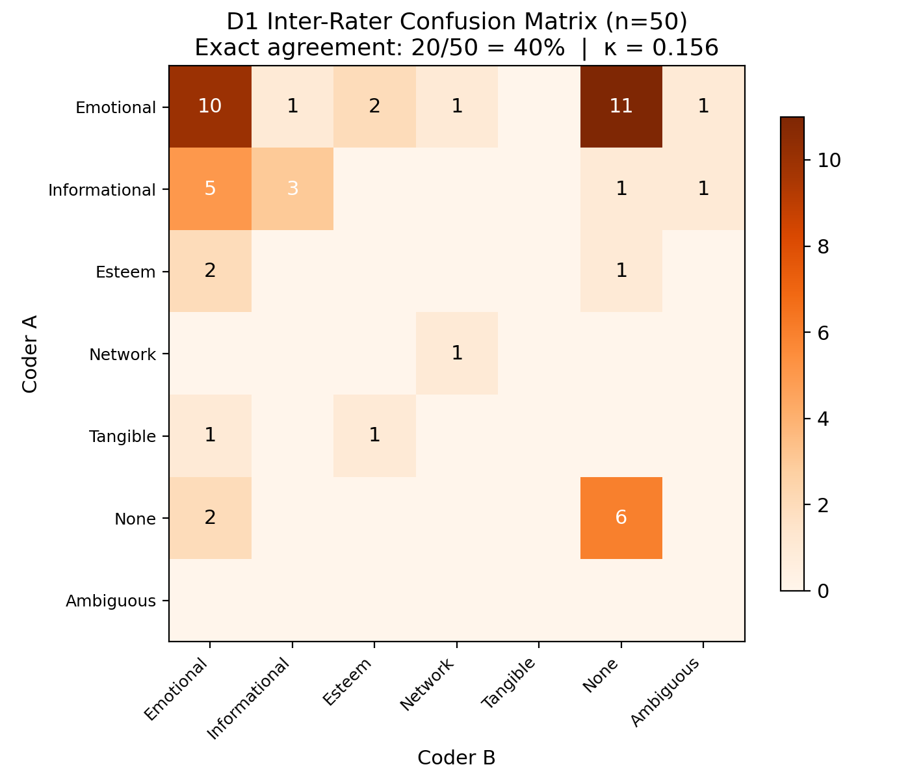
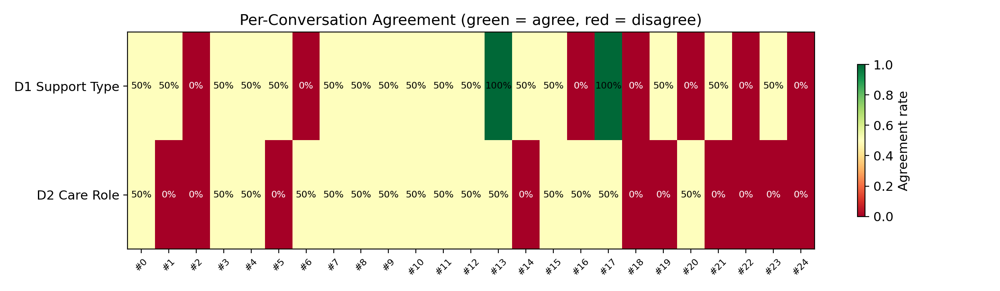
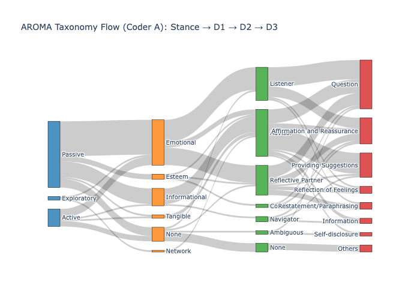
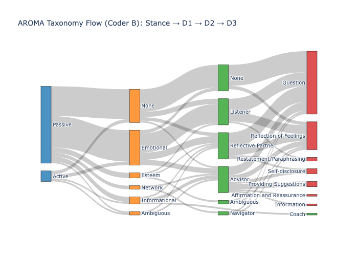

# AROMA Calibration Report #1

**Date:** 2026-03-28
**Coders:** 2 (Coder A: bf32f904, Coder B: 41f829d6)
**Conversations:** ESConv_0 – ESConv_24 (25 conversations, full double-coded)
**Sequences:** 50 per coder (100 total annotations)
**Sequence window:** 5 turns each — `[2,7)` (early) and `[7,12)` (later)

> [!NOTE]
> **Data Origin:** ESConv is a human-human dataset collected via crowd-sourcing. The "supporters" were human participants, not AI agents. 

---

## Summary of Agreement

| Dimension                  | Cohen's κ [95% CI]    | Exact Agreement | Interpretation |
| -------------------------- | --------------------- | --------------- | -------------- |
| **Phase 1: Seeker Stance** | 0.349 [0.028, 0.666]  | 40/50 (80%)     | Fair           |
| **D1 Support Type**        | 0.156 [−0.022, 0.339] | 20/50 (40%)     | Slight         |
| **D2 Care Role**           | 0.114 [−0.028, 0.271] | 15/50 (30%)     | Slight         |
| **Role-Stance Alignment**  | —                     | 12/50 (24%)     | Poor           |
| **D3 Strategy (Jaccard)**  | —                     | Mean 0.34       | Low overlap    |

Both D1 and D2 kappas are below acceptable thresholds (κ > 0.60 for CHI-quality annotation). The 95% bootstrap confidence intervals for D1 and D2 both cross zero, meaning we cannot confidently claim agreement exceeds chance at this sample size. However, the disagreement patterns are systematic and internally consistent across dimensions (Finding 4), which indicates a calibration problem rather than a taxonomy problem — coder profiles diverge in predictable, addressable ways.

---

## 0. Phase 1 — Seeker Stance

Phase 1 requires coders to judge the seeker's relational posture (Passive, Exploratory, or Active) before seeing the supporter responses. This is the foundational categorization that governs downstream Role-Stance Alignment logic.

### Stance Confusion Matrix

At κ=0.349 [95% CI: 0.028, 0.666], Seeker Stance shows higher reliability than D1 or D2, but the wide CI means even this "Fair" rating is uncertain. The raw 80% agreement is inflated by the skewed base rate (Passive dominates), which κ already corrects for. The dominant disagreement axis is **Active ↔ Passive** (8 sequences).

- **Over-detection of Active**: Coder A identifies more "Active" stances (n=10) than Coder B (n=6).
- **Exploratory is effectively absent**: n=2 by Coder A, n=0 by Coder B. This is not just a threshold problem — Exploratory (genuine self-reflective engagement) may be structurally rare in ESConv. Crowd-sourced seekers tend to either vent (Passive) or request help (Active). Like Companion in D2, Exploratory may require supplementary corpus for validation.

### Does Stance disagreement cause D2 disagreement?

The initial hypothesis was that Phase 1 disagreement cascades into D2. The conditional analysis shows this is **not the primary mechanism**:

| Subset | n | D2 Agreement | D2 κ |
|---|---|---|---|
| Stance agrees | 40 | 11/40 (27.5%) | 0.083 |
| Stance disagrees | 10 | 4/10 (40.0%) | — |
| Overall | 50 | 15/50 (30.0%) | 0.114 |

D2 κ *drops* to 0.083 when restricted to stance-agreement cases. Stance disagreement is not the main driver of D2 problems — the D2 codebook boundaries (None/Listener/Reflective Partner triad) are independently unreliable.

---

## 1. D1 — Support Type Distribution

Both coders show the same dominant pattern: Emotional support is the most common category. Key differences:
- **Coder A** assigns Emotional more often and uses "None" less
- **Coder B** assigns "None" more frequently, consistent with a stricter threshold for when support begins
- Esteem, Network, and Tangible appear sporadically. **Appraisal is absent entirely.**

### D1 Confusion Matrix

The dominant disagreement axis is **Emotional ↔ None** (13 sequences) — nearly half of all D1 disagreements. This is a threshold problem: coders disagree on whether early-sequence questioning constitutes emotional engagement.

| D1 Boundary                   | Count | Pattern                                         |
| ----------------------------- | ----- | ----------------------------------------------- |
| **Emotional ↔ None**          | 13    | When does questioning become emotional support? |
| **Emotional ↔ Informational** | 6     | Validation vs. information-giving               |
| **Emotional ↔ Esteem**        | 3     | Encouragement vs. emotional support             |

Should we have multi-labels ? 

Score 1 - 5 
if doesn't exist it will be zero.
add keyboard shortcuts to the UI
---

## 2. D2 — Care Role Distribution

The biggest coder divergence:
- **Coder A** codes more **Advisor** and **Listener**
- **Coder B** codes more **Reflective Partner** and **None**

This suggests a systematic calibration difference: what Coder A reads as directive intent (Advisor), Coder B reads as still probing/reflective (Reflective Partner). Coach and Navigator are marginal for both. **Companion is absent.**

Multiple choice 
Score 1 - 5 
if doesn't exist it will be zero.

### D2 Confusion Matrix

Three systematic disagreement clusters:

| D2 Boundary | Count | Pattern |
|---|---|---|
| **Listener ↔ None** | 9 | One coder sees incipient listening; the other sees no role yet |
| **Listener ↔ Reflective Partner** | 8 | Acknowledging vs. synthesizing |
| **None ↔ Reflective Partner** | 5 | Threshold for any role assignment |
| **Advisor ↔ Reflective Partner** | 4 | Directive vs. insight-building |
| **Advisor ↔ Listener** | 3 | Directive advice vs. active listening |

The top 3 disagreement clusters all involve the **None/Listener/Reflective Partner triad** — they account for 22 of 35 disagreements (63%). This is a role-onset boundary problem.

---

## 3. D3 — Support Strategy Frequency

Question dominates for both coders. Key differences:
- **Coder A** uses "Affirmation and Reassurance" and "Providing Suggestions" more — aligning with the more directive D2 pattern
- **Coder B** uses "Reflection of Feelings" more — aligning with the more reflective D2 pattern

### Multi-Label Distribution

Coder A multi-labels more often (more 2- and 3-strategy sequences), while Coder B tends toward single labels. D3 captures observable co-occurring behaviors more reliably than D2's single-role assignment.

### D2 Role → D3 Strategy Profile

This cross-tabulation reveals clear strategy signatures per role:
- **Listener** is dominated by Question (50%+) and Affirmation
- **Advisor** is dominated by Providing Suggestions — validates the D2 label
- **Reflective Partner** has a mixed profile (Question + Affirmation + Restatement)
- **Coach** has too few instances (n=3) for a reliable profile

This is a useful diagnostic: when D2 labels disagree, checking which D3 strategies were assigned can reveal whether the disagreement is about the label or the observation.

---

## 4. The Short-Sequence Problem

Early `[2,7)` sequences receive "None" labels significantly more often than `[7,12)` sequences.

### Agreement by Sequence Position

The position effect on agreement is severe:

| Position | D1 Agreement | D2 Agreement |
|---|---|---|
| `[2,7)` early | 28% (7/25) | 20% (5/25) |
| `[7,12)` later | 52% (13/25) | 40% (10/25) |

Agreement roughly **doubles** in later sequences. Early turns are ambiguous — coders can't tell whether questioning is rapport-building, information-gathering, or emotional engagement within 5 turns.

### Implications
- 5-turn windows starting at turn 2 produce excessive "None" labels and inflate disagreement
- The codebook needs explicit guidance: does early intake count as "Listener" or "None"?
- Consider extending the first sequence window or adding a "role onset" marker

---

## 5. Per-Conversation Agreement

Agreement varies widely by conversation. ESConv_15 is the only conversation with perfect D1+D2 agreement on both sequences. Conversations ESConv_0, _1, _2, _5, _14, _18, _19, _21, _22, _23, _24 show **zero D2 agreement** — coders disagree on every sequence.

This suggests some conversations are intrinsically harder to code (ambiguous supporter behavior), while others have clearer role signatures.

---

## 6. Role-Stance Alignment

- Both coders agree that fully aligned support is the minority (~29%)
- **Calculated Misalignment**: The system identifies significantly more "misaligned_paradox_risk" for Coder A's annotations — driven by their higher frequency of Advisor labels for Passive seekers.
- **Misfit**: Coder B's Reflective Partner labels frequently trigger "misfit" flags when paired with Passive/Active stances.

### Decomposing alignment disagreement

Agreement on the derived alignment metric is only 24% (12/50). The table below separates two distinct failure modes:

| Stance agreement? | Alignment agreed | Alignment disagreed | Total |
|---|---|---|---|
| **Stance agreed** | 12 | 28 | 40 |
| **Stance disagreed** | 0 | 10 | 10 |

- **28 cases**: Stance agreed but alignment disagreed. This is a pure **Role-level problem** — coders agreed on what the seeker wanted but disagreed on what the supporter was doing (D2). This is the dominant failure mode (56% of all sequences).
- **10 cases**: Stance disagreed, so alignment was doomed regardless of D2. This is a **Phase 1 cascade**.
- **0 cases**: Stance disagreed but alignment somehow agreed — this never happened, confirming that Stance disagreement guarantees alignment disagreement.

The alignment metric's poor reliability is overwhelmingly driven by D2 disagreement (28/38 = 74% of disagreement cases), not Phase 1.

The prevalence of calculated misfit + paradox_risk supports the theoretical prediction that ESConv supporters frequently operate beyond their relational warrant.

---

## 7. Coder Confidence Does Not Predict Agreement

Confidence is moderate for both sequence positions (mostly score 2). Low confidence annotations (n=3 across both coders) are rare. Critically, confidence does **not** predict agreement — coders are equally confident in cases where they agree and disagree (D2 agreement hovers at ~31–33% across all confidence levels).

This is a concerning finding: coders cannot self-monitor their uncertainty. High-confidence disagreements are the most dangerous failure mode — coders are each certain they are right, making adjudication harder. The calibration session should prioritize high-confidence disagreements as discussion cases, and the codebook should add an explicit "flag for discussion" instruction when confidence < 2.

---

## 8. D3 Strategy Agreement: ESConv Ground Truth vs Human Coders

> [!IMPORTANT]
> **Unit-of-analysis mismatch:** ESConv labels are *turn-level* (one strategy per supporter turn). Our annotations are *sequence-level* (a multi-label set per 5-turn window). For comparison, we aggregate ESConv turn-level labels into a set per sequence. This means a sequence labeled "Question" by a human coder may correspond to 3 Question turns and 2 Affirmation turns in ESConv. Low Jaccard scores therefore partly reflect aggregation loss, not coding error. Per-strategy κ values below should be interpreted with this caveat.

### Strategy Frequency Comparison

### Per-Strategy Cohen's Kappa

| Strategy | ESConv n | Coder A n | κ (A) | Coder B n | κ (B) |
|---|---|---|---|---|---|
| Question | 32 | 28 | 0.255 | 36 | 0.361 |
| Affirmation and Reassurance | 15 | 15 | 0.429 | 1 | -0.039 |
| Providing Suggestions | 8 | 14 | 0.429 | 3 | 0.303 |
| Reflection of Feelings | 11 | 3 | -0.104 | 16 | -0.052 |
| Self-disclosure | 12 | 3 | 0.189 | 3 | 0.189 |
| Information | 3 | 3 | -0.064 | 1 | -0.031 |
| Restatement/Paraphrasing | 13 | 4 | 0.129 | 2 | 0.069 |
| Others | 12 | 4 | 0.290 | 0 | 0.000 |

Key observations:
- **Question** kappa improved (Coder B: 0.361) — most frequently co-assigned strategy
- **Affirmation and Reassurance**: Coder A aligns with ESConv (κ=0.429); Coder B virtually never assigns it (n=1)
- **Reflection of Feelings**: Neither coder aligns with ESConv (negative κ), but in opposite directions — Coder A under-detects, Coder B over-detects
- **Restatement/Paraphrasing**: Both coders dramatically under-detect vs ESConv (13 in ESConv, 4 and 2 in human coding)

### Set-Level Similarity

| Comparison | Mean Jaccard | Median Jaccard | Exact Match |
|---|---|---|---|
| ESConv vs Coder A | 0.37 | 0.33 | 12.0% |
| ESConv vs Coder B | 0.31 | 0.33 | 8.0% |
| Coder A vs Coder B | 0.34 | 0.29 | 18.0% |

Inter-coder exact match (18%) is higher than either coder vs ESConv — suggesting the human coders share a systematic re-interpretation of strategies relative to the ESConv ground truth, rather than being randomly noisy.

---

## 9. Key Findings

### Finding 1: Agreement is below acceptable thresholds, and CIs cross zero
D1 κ=0.156 [95% CI: −0.022, 0.339] and D2 κ=0.114 [95% CI: −0.028, 0.271] are both in the "slight agreement" range. The 95% bootstrap confidence intervals cross zero for both dimensions, meaning we cannot confidently claim agreement exceeds chance at n=50. For a CHI submission claiming empirical annotation, we need κ > 0.60. This requires targeted codebook clarification before proceeding to Phase 2.

### Finding 2: The None/Listener/Reflective Partner triad is the primary disagreement source
63% of D2 disagreements involve these three labels. The Emotional ↔ None boundary drives 47% of D1 disagreements. Both are role-onset problems.

### Finding 3: Agreement doubles in later sequences
Early sequences ([2,7)) have 20% D2 agreement; later sequences ([7,12)) have 40%. The 5-turn window at conversation start is systematically ambiguous.

### Finding 4: Coder profiles are internally consistent but divergent
Coder A codes more directive roles (Advisor) with directive strategies (Providing Suggestions, Affirmation). Coder B codes more reflective roles (Reflective Partner) with reflective strategies (Reflection of Feelings). This is a calibration gap, not random noise — addressable through adjudication.

### Finding 5: D2 and D3 are mutually validating
The D2→D3 cross-tabulation shows clear strategy signatures per role. When coders assign "Advisor", they also assign "Providing Suggestions". This internal consistency validates the taxonomy design even as inter-rater reliability needs improvement.

### Finding 6: Confidence does not predict agreement
Coders are equally confident in agreed and disagreed cases (D2 agreement ~31–33% at all confidence levels). Coders cannot self-monitor their uncertainty. The calibration session must prioritize high-confidence disagreements, and the codebook should add a "flag for discussion" instruction when confidence < 2.

### Finding 7: D2 problems are independent of Phase 1
Conditional analysis shows D2 κ *drops* to 0.083 when restricted to sequences where Stance agrees (vs. 0.114 overall). The Role-Stance Alignment metric's poor reliability is 74% attributable to D2 disagreement, not Phase 1 cascade (§6). Fixing D2 boundaries is the highest-leverage intervention.

### Finding 8: Proposed codebook rules have mixed empirical support
Back-testing the three proposed decision rules against the current data (§10): Rule 1 (Question → Listener not None) resolves 5/9 (56%) of target disagreements. Rule 2 (Restatement → RP not Listener) resolves 0/7. Rule 3 (Emotional D3 → Emotional not None) resolves 1/13. Rules 2 and 3 need fundamentally different operationalization strategies.

---

## 10. Codebook Recommendations

1. **Sharpen the None/Listener boundary.** Add explicit decision rule: if the supporter asks >= 1 question in the sequence window, code at minimum "Listener" (not "None"). 
    *   **Back-test:** This rule would have resolved **5/9 (56%)** of current Listener ↔ None disagreements.

2. **Sharpen the Listener/Reflective Partner boundary.** Current distinction (acknowledging vs. synthesizing) is too subtle. Operationalization: if the supporter restates or paraphrases any seeker content, it's Reflective Partner. 
    *   **Back-test:** Currently resolves 0/7 cases—suggests the issue is *under-detection* of restatement in D3, not just the D2 label choice.

3. **Sharpen the Emotional/None D1 boundary.** Any questioning that acknowledges the seeker's emotional state should be coded Emotional. 
    *   **Back-test:** Resolves 1/13 cases. Requires broader criteria (any problem-oriented question should trigger Emotional).

4. **Add "Restatement/Paraphrasing" calibration examples.** Both coders dramatically under-detect this relative to ESConv ground truth (13 in ESConv vs 4 and 2). Need explicit examples.

5. **Consider extending early sequence window.** [2,7) may be too narrow for role emergence. Options: extend to [2,9), overlap windows, or add a "pre-role" phase marker.

---

## 11. D1 Taxonomy Review: Should We Remove Sparse Categories?

Appraisal (0 instances), Tangible (2), and Network (3) are barely present. The instinct is to cut them. **Don't.** The absence is a property of ESConv, not the taxonomy.

### Why D1 is underperforming

D1 is operationally coupled to D2. The codebook maps each D2 role to a primary D1 type (Listener → Emotional, Advisor → Informational, Reflective Partner → Appraisal, etc.). In practice, coders code D2 first via the decision tree, then D1 is largely determined by D2. The D1 distribution mirrors D2 almost exactly. This is a **Nickerson conciseness risk** — the same issue that killed old D3 (Core Function).

### Why the sparse categories are absent

| Category | Why absent in ESConv | Would appear in... |
|---|---|---|
| **Appraisal** | Reflective Partner under-coded (confused with Listener). ESConv crowd-workers rarely do genuine meaning-making. | Clinical therapy transcripts, CBT-oriented chatbots |
| **Tangible** | Text-chat — no material resources exchanged. AI structurally cannot provide tangible support. | Navigator referrals in crisis settings (barely) |
| **Network** | ESConv supporters don't refer seekers to communities. Single-session design prevents it. | Multi-session AI companions, peer support platforms |

### Literature cross-reference

| Framework | Categories |
|---|---|
| **House (1981)** | Emotional, Appraisal, Informational, Instrumental |
| **Cutrona & Suhr (1992) SSBC** | Emotional, Informational, Esteem, Network, Tangible |
| **AROMA (current)** | Emotional, Informational, Esteem, Network, Tangible, Appraisal |

AROMA takes the union. House already included Appraisal (meaning-making) as a first-class category. The Lazarus & Folkman (1984) extension is well-precedented.

### Three options considered

**Option A — D1 becomes a derived variable (not independently coded).** Compute D1 from D2 + D3 mapping. Eliminates D1 as a source of κ drag. Loses the theoretical claim that D1 is independent of D2.

**Option B — Collapse to 3 super-categories for annotation.** Emotional + Esteem → "Emotional"; Informational + Appraisal → "Cognitive"; Network + Tangible → "Instrumental" (aligns with House 1981). Higher base rates, higher κ. Loses granularity — Esteem and Emotional are distinct interventions (Coach delivers Esteem, Listener delivers Emotional).

**Option C (recommended) — Keep all 6, fix the threshold problem.** The data shows the real problem is the **Emotional ↔ None boundary** (13/30 D1 disagreements = 43%). Fix this, and κ jumps significantly.

Specific threshold fixes:
1. **None** only when the sequence contains zero support-oriented behavior — pure small talk, logistics, or meta-conversation. Any question about the seeker's state = at minimum Emotional.
2. **Appraisal** gets an explicit trigger: code when the supporter helps the seeker *reinterpret* their situation (cognitive reframing). Currently absent because the codebook only mentions it as Reflective Partner's primary D1, and coders rarely code Reflective Partner.
3. **Accept sparsity** for Network/Tangible. Acknowledge in the paper that ESConv validates the *framework*, not full coverage. The embedding model (C3) will need supplementary corpora.
4. **Add a D1-only calibration exercise** before Phase 2 — 10 sequences coded for D1 without D2, to test whether D1 is genuinely independent.

### Suggested paper language

> *The Cutrona & Suhr (1992) SSBC provides 5 categories; we extend to 6 with Appraisal (Lazarus & Folkman, 1984). In our ESConv validation, 3 of 6 types (Emotional, Informational, Esteem) account for 97% of non-None labels. Appraisal, Network, and Tangible are structurally sparse in ESConv: Appraisal requires explicit cognitive reframing (rare in crowd-sourced support), Network requires community referral (absent in single-session design), and Tangible requires material resource exchange (impossible in text chat). We retain all 6 in the taxonomy because they are theoretically necessary for describing the full space of AI-mediated care — their absence in ESConv is a property of the corpus, not the taxonomy.*

---

## 12. Taxonomy Flow (Sankey)

The Sankey diagrams below visualize the relational flow from Phase 1 (Seeker Stance) through the AROMA dimensions (D1 Support Type → D2 Care Role → D3 Strategies). 

### Team Level Flow (Combined)

The following diagram aggregates annotations from both coders to show the overall structural distribution of the AROMA taxonomy across the ESConv corpus.

### Coder-Specific Flows (Divergence Analysis)

Comparing individual flows reveals the "strategy signatures" of each coder. For instance, Coder A's flow shows a stronger weighting toward directive roles (Advisor) and associated strategies (Providing Suggestions), while Coder B's flow remains more concentrated in reflective/listening categories.

---

## Next Steps

1. **Adjudication session** — walk through the 35 D2 disagreements together. Priority: the 22 in the None/Listener/Reflective Partner triad. Include high-confidence disagreements explicitly (Finding 6).
2. **Codebook v0.3** — implement Rule 1 **(back-tested at 56% resolution)**. For Rules 2 and 3, develop new operationalization strategies informed by adjudication (Finding 8). Add D1 threshold fixes from §11 and "flag for discussion" instruction.
3. **D1 independence test** — code 10 sequences for D1 only (no D2) to check whether D1 adds signal beyond what D2 predicts.
4. **Re-code 10 sequences** post-adjudication to measure κ improvement. Target: CIs fully above zero as first milestone, κ > 0.40 as second.
5. **Plan supplementary corpus** for underrepresented roles (Companion, Navigator, Coach), support types (Appraisal, Network), and stances (Exploratory).

Meeting discussion

Support doesnt happen if it is just small talk. We want to see direct question on the seeker's welfare or specific actionable to be considered support.

Emotional support has to be tied to asking questions about feelings, not just weather or holiday or ....

"How Are You" -> Not yet emotional support

Conversations are too short -> we should extend the sequence to 12 turns

change D1 and D2 
Multiple choice 
Score 1 - 5  (linkert chart)
if doesn't exist it will be zero.