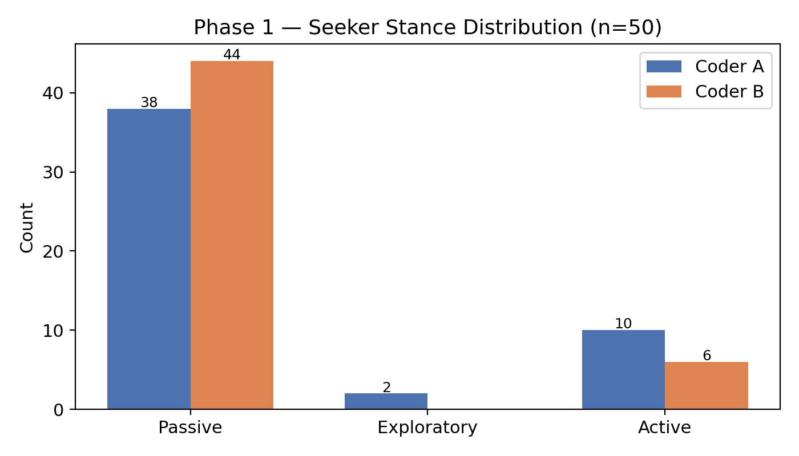
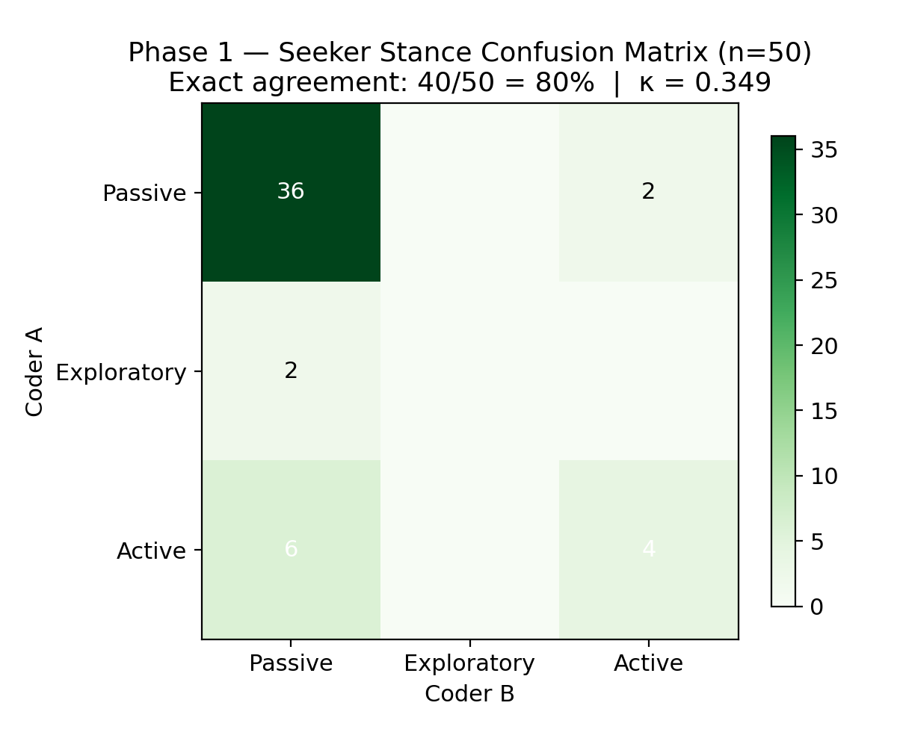
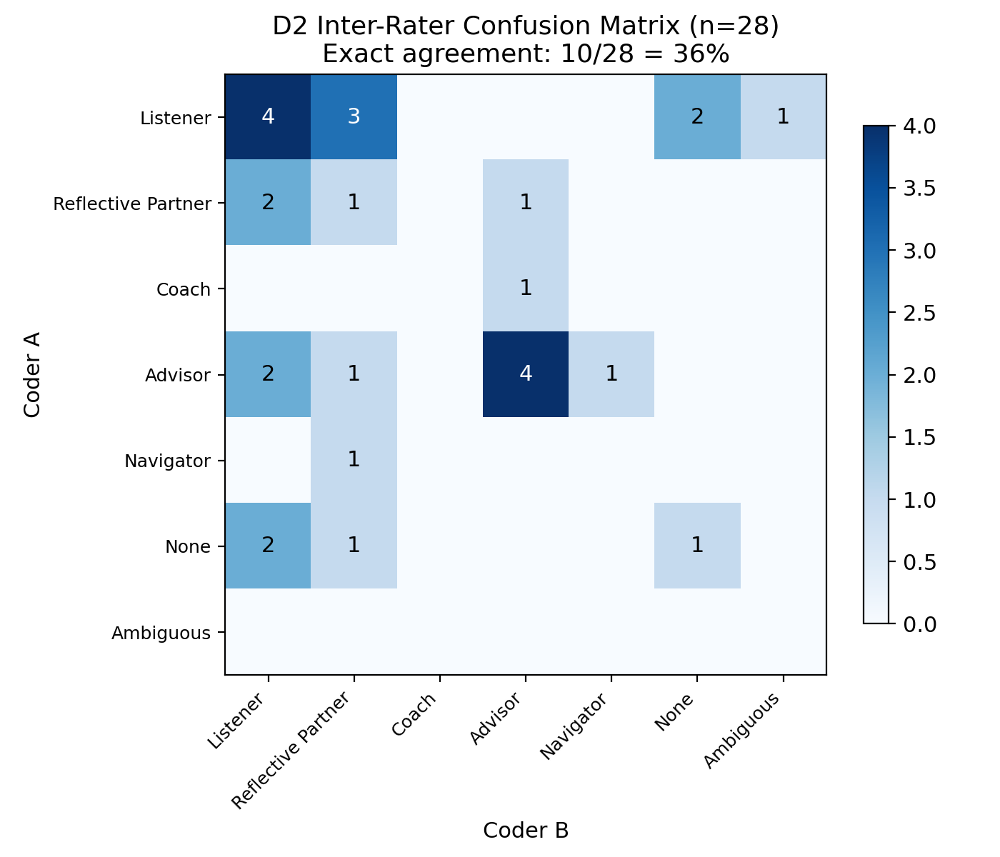
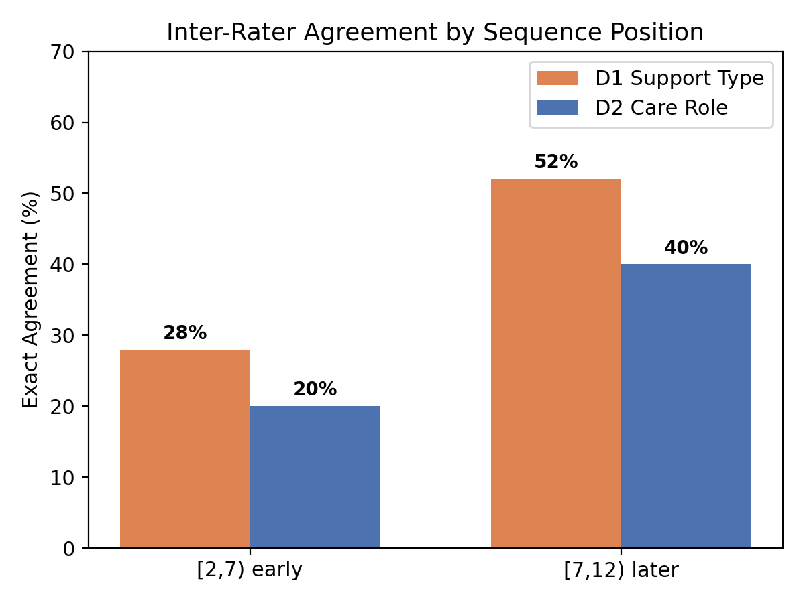
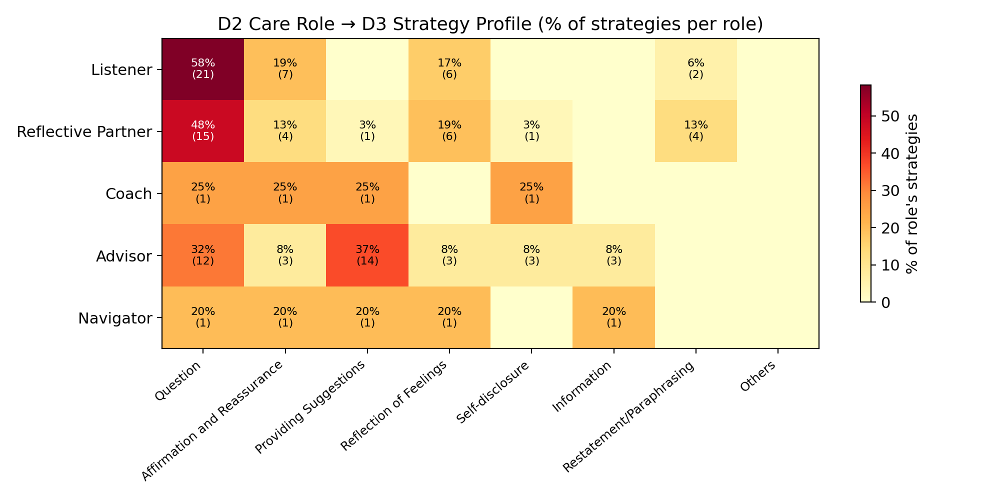
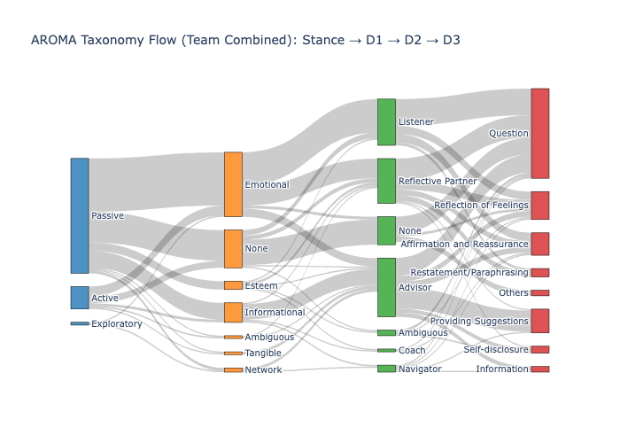

# AROMA Calibration Report #1: Executive Summary

**Date:** 2026-03-28
**Scope:** Phase 1 Calibration (ESConv 0–24)
**Method:** 2 Coders | 50 paired sequences (5 turns each) | Double-coded

---

## 1. Overview: Purpose of Calibration

The goal of this pilot was to test how accurately our **AROMA Taxonomy** describes real-world peer support data (ESConv). While initial reliability scores are low, the patterns are **systematic and addressable**. The low scores reflect a "threshold problem" — coders see the same thing but disagree on *when* behavior becomes support.

### What We Were Measuring

AROMA codes support conversations along three independent dimensions, plus a foundational stance assessment:

- **Seeker Stance (Phase 1):** Before looking at the supporter's responses, coders assess the *seeker's* relational posture — how ready they are to engage with structured help. This is the foundational context that determines what kind of support is appropriate.
- **D1 — Support Type:** *What kind of help is being provided?* Categorizes the functional nature of the support (e.g., emotional comfort vs. factual information vs. resource connection), based on Cutrona & Suhr's (1992) Social Support Behavior Code.
- **D2 — Care Role:** *What relational stance is the supporter adopting?* Identifies the role the supporter enacts across the sequence (e.g., a non-directive Listener vs. an expertise-driven Advisor), based on Biddle's (1986) role theory and Blumer's (1969) symbolic interactionism.
- **D3 — Support Strategy:** *What specific conversational moves are being used?* Tags the observable turn-level behaviors (e.g., asking questions, providing suggestions, reflecting feelings), based on Hill (2009) and ESConv's original labels.

### Performance Summary

| Dimension | Cohen's κ | Agreement | What It Tells Us |
| :--- | :--- | :--- | :--- |
| **Seeker Stance** | 0.349 (Fair) | 80% | Coders read the seeker similarly, but disagree on where venting ends and requests begin |
| **D1 Support Type** | 0.156 (Slight) | 40% | Coders can't agree on when generic questioning becomes Emotional support |
| **D2 Care Role** | 0.114 (Slight) | 30% | Coders can't agree on when behavior crosses from "no role yet" to Listener or Reflective Partner |

> [!TIP]
> **Key Insight:** A "Slight" kappa of 0.114 doesn't mean the taxonomy is failing; it means our 5-turn window was too narrow to capture role-emergence clearly. The disagreements are systematic and concentrated in predictable boundaries.

---

## 2. Seeker Stance (Foundational Data)

The seeker's posture (Phase 1) is the core context that governs all downstream coding. Coders assess this *before* seeing the supporter's responses, to prevent the supporter's behavior from biasing the judgment.

### What the three stances mean

| Stance | Definition | What coders look for |
| :--- | :--- | :--- |
| **Passive** | The seeker is venting, disclosing, or seeking witness. They haven't formulated a request and aren't engaging with structure. Coping resources are low or the stressor feels uncontrollable. | Emotional disclosure without questions; extended narrative; minimal engagement with AI-offered structure ("Yeah," "I guess"); expressions of helplessness or overwhelm. |
| **Exploratory** | The seeker is willing to reflect and make meaning but isn't yet oriented toward action. They're between emotion and action — the meaning-making phase. | Substantive engagement with reframes; "why" or "how" questions about their own experience; elaborates when prompted; may resist premature advice ("I need to understand this first"). |
| **Active** | The seeker is oriented toward action, decisions, or information. They've identified what they need and are seeking structured help to get it. | Direct questions ("What should I do?"); goal-oriented language; evaluative engagement with suggestions; requests for resources or next steps. |

**What this shows:** Most seekers in ESConv are **Passive**. They are venting or expressing distress but haven't yet formulated a request. This is expected — ESConv is a crowd-sourced emotional support corpus where seekers enter in distress.

**Where coders diverge:** The biggest confusion is **Active vs Passive** (8 sequences) — where venting ends and requests begin. A seeker who says "I don't know what to do" could be expressing helplessness (Passive) or implicitly requesting direction (Active). **Exploratory** stances are almost entirely absent in this corpus (n=2 total), suggesting crowd-sourced support is less self-reflective than clinical data — seekers tend to either vent or ask for help, not engage in structured meaning-making.

---

## 3. D1 — Support Type Divergence (The "Threshold" Problem)

D1 codes *what kind of help* is being provided. The 6 core support types are:

| Type | Definition | What coders look for |
| :--- | :--- | :--- |
| **Emotional** | Empathy, sympathy, and concern directed at alleviating emotional distress. The supporter attends to the seeker's feelings as the primary focus. | Active inquiry about feelings; deep validation of the seeker's specific emotional state; concern and sympathy. **Not just "I'm sorry to hear that"** — requires genuine engagement with the emotional content. |
| **Informational** | Advice, suggestions, factual information, or guidance. The supporter provides knowledge the seeker doesn't have. | Psychoeducation; direct advice; factual explanations; clinical vocabulary; "Here's what the research shows." |
| **Esteem** | Affirming the seeker's worth, strengths, or positive qualities. The supporter builds the seeker's sense of competence. | Affirming specific strengths; "You handled that well"; building self-efficacy. Distinct from Emotional — Esteem says "you're capable," Emotional says "your feelings are valid." |
| **Appraisal** | Helping the seeker reframe or make meaning of their situation. The supporter facilitates cognitive reappraisal. | Reframing prompts; perspective-taking invitations; "What would it look like from their side?" Rare in ESConv — requires genuine cognitive restructuring, not just questioning. |
| **Network** | Connecting the seeker to others, communities, or shared experiences. The supporter bridges to social resources. | Referrals to support groups; "Have you talked to anyone else about this?"; community connection. Absent in ESConv's single-session design. |
| **Tangible** | Offering concrete, practical assistance or crisis resources. The supporter provides or connects to material help. | Resource listings; crisis hotline numbers; practical logistics. Structurally limited in text-chat. |

**The dominant disagreement:** 43% of D1 disagreements (13/30) are on the **Emotional vs None** boundary. Coders agree that early-sequence questioning is happening, but disagree on whether it constitutes emotional support or is still "onboarding" small talk. One coder treated any problem-oriented question as Emotional; the other required explicit emotional engagement.

---

## 4. D2 — Care Role Divergence (The "Onboarding" Problem)

D2 codes *what relational stance* the supporter adopts. The 6 core care roles, mapped to the decision tree:

| Role | Decision Tree Path | Definition | What coders look for |
| :--- | :--- | :--- | :--- |
| **Listener** | Following → This Disclosure | Receptive, non-directive. Mirrors, validates, follows the seeker's lead without steering or problem-solving. | Paraphrasing; minimal encouragers; open-ended following questions; no new topics introduced; no redirecting. |
| **Reflective Partner** | Leading → Internal State | Socratic, exploratory. Introduces cognitive frames and holds open questions to facilitate the seeker's own insight — without providing answers. | Socratic questions; cognitive reappraisal prompts; "Summarize and Invite Correction" pattern; introduces perspectives the seeker hadn't articulated. |
| **Coach** | Leading → External Action → Motivation | Directive, motivating. Builds self-efficacy and supports action toward goals the seeker has identified. | Goal-setting language; change-talk elicitation; progress check-ins; affirmation tied to specific user actions. |
| **Advisor** | Leading → External Action → Information | Authoritative, expertise-led. Provides psychoeducation, clinical information, and structured guidance from a domain expert stance. | Psychoeducation delivery; direct advice; clinical vocabulary; imperative framing ("It's important to..."). |
| **Companion** | Following → The Relationship | Warm, persistent presence focused on relational bonding across sessions. The commitment is to presence itself, not a task. | Reciprocal disclosure; shared references to past interactions; personalization; longitudinal continuity markers. Requires multi-session context — structurally absent in ESConv. |
| **Navigator** | Leading → External Action → Resources | Practical, resource-oriented. Connects the seeker to external systems, services, and crisis resources via warm handoff. | Resource listings with context; triage questions; referral framing; crisis protocol language. |

**The Failure Mode:** 63% of D2 disagreements happen within the **None / Listener / Reflective Partner triad**.

| Boundary | Count | What coders were confused about |
| :--- | :--- | :--- |
| **None vs Listener** | 9 | Is early-sequence questioning (intake, rapport) a care role or pre-role behavior? One coder treated any question as incipient Listening; the other required explicit emotional tracking. |
| **Listener vs Reflective Partner** | 8 | Is the supporter *following* (mirroring the seeker's frame) or *leading* (introducing new frames)? The codebook test — "Does the AI introduce a perspective the user hadn't articulated?" — was clear in principle but hard to apply when the supporter asks a question that could be read as either following or reframing. |
| **None vs Reflective Partner** | 5 | Combines both problems: coders disagree on whether behavior is a role at all, and if it is, whether it's passive or active inquiry. |

**Solution:** The "Small Talk" Threshold rule resolves None vs Listener: Greetings = None; a direct question about welfare = Listener at minimum. The Listener/RP boundary requires the 12-turn window to give coders enough context to see whether questioning is sustained reframing (RP) or isolated (Listener).

---

## 5. The 12-Turn Rationale (Crucial Finding)

This is the most actionable data point from the pilot.

**The Discovery:** Agreement roughly **doubles** in later turns (7-12) compared to early turns (2-7).

| Position | D1 Agreement | D2 Agreement |
| :--- | :--- | :--- |
| Early `[2,7)` | 28% | 20% |
| Later `[7,12)` | 52% | 40% |

**Why this matters:** In the first 5 turns, supporters are typically doing intake — asking about the problem, establishing rapport. This looks the same whether the supporter will eventually become a Listener, Reflective Partner, or Advisor. The *role* hasn't emerged yet. By turns 7-12, the supporter has committed to a stance (directive vs. non-directive, emotional vs. informational), and coders can identify it.

**Change:** For Phase 2, we move to **12-turn windows** (turns 1-12) to capture the full arc from intake to role-emergence.

---

## 6. Validating the Relational Logic

Despite low inter-rater scores, the taxonomy's internal structure is sound.

**Validation:** When a coder labels a sequence as "Advisor," they consistently tag "Providing Suggestions" in D3. When they label "Listener," D3 is dominated by "Question" and "Affirmation." This proves that individual coders apply the taxonomy coherently — the D2 role and D3 strategy signatures align as the codebook predicts. The problem is not that coders interpret the roles differently; it's that they disagree on *when a role begins*.

**The Relational Signature:** This Sankey diagram visualizes the full AROMA flow — from seeker distress (Phase 1: Stance) through support types (D1) and care roles (D2) to observable strategies (D3). It confirms that **Emotional Support** is the most common intervention in ESConv, that Passive seekers dominate the corpus, and that the taxonomy captures meaningful structural variation even in a single-corpus pilot.

---

## 7. Phase 2 Refinements (The "Post-Adjudicated" Protocol)

Based on the reconciliation meeting, we are implementing these shifts:

### A. The "Support Trigger" Rule
- **0 (None)** = Small talk, greetings, weather. *"How are you?"* is not yet support.
- **Support begins** = Must include a direct question about the seeker's welfare/feelings, or a specific actionable suggestion.

### B. Discrete Ordinal Scoring (0 / 1 / 3 / 5)
Coders rate all 6 core roles (D2) and 6 core support types (D1) on a **discrete ordinal scale** with anchored levels:
- **0** = Not present.
- **1** = Trace / minimal.
- **3** = Moderate / clear.
- **5** = Dominant / definitive.
- Intermediate values (2, 4) are excluded to prevent unanchored drift.
- The **primary role** (argmax of D2 scores) remains the analytical unit for alignment and IRR; the full score vector provides secondary diagnostic data.
- *'Ambiguous' and 'None' are not scored on the Likert scale — 0 already captures absence.*

### C. Role Transition Marker
- Coders flag whether the AI's role **shifted within the 12-turn window** (boolean).
- When flagged, an optional **boundary turn number** records where the shift occurred.

### D. Duration Adjustment
- **New Unit of Analysis:** 12-turn sequences.
- *Starting Batch 2 with turns 1-12 to maximize the "relational signal."*

### E. Reliability Metric: ICC(2,1)
- Phase 2 replaces Cohen's kappa with **ICC(2,1)** (two-way random, single measures, absolute agreement) for D1 and D2.
- ICC is computed per category (e.g., Listener, Advisor) and averaged for an overall dimension score.
- Target: ICC > 0.60 (moderate–good).

---

> [!IMPORTANT]
> **Goal:** These changes target ICC > 0.60 for our CHI '26 submission by resolving the "resolution" and "threshold" problems identified in this report.
