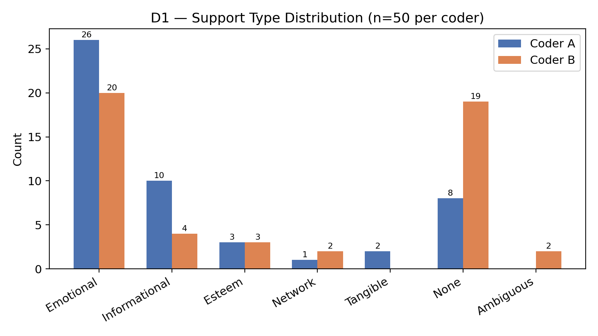
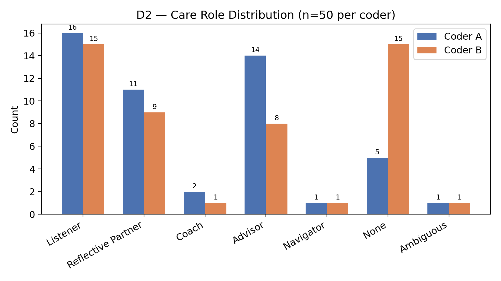
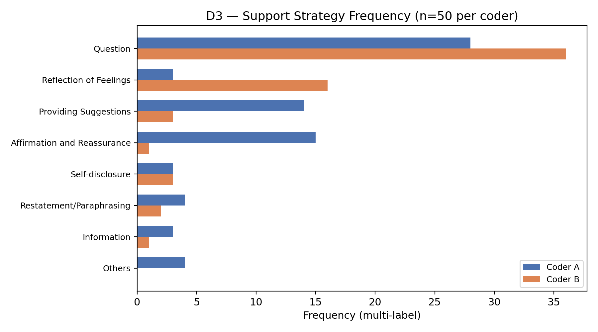
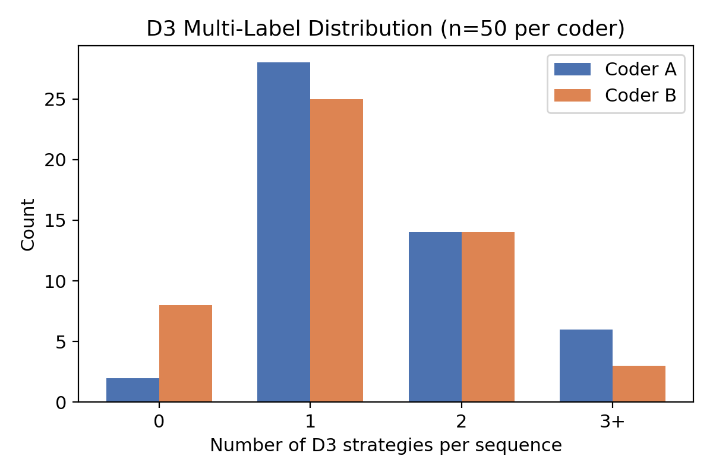
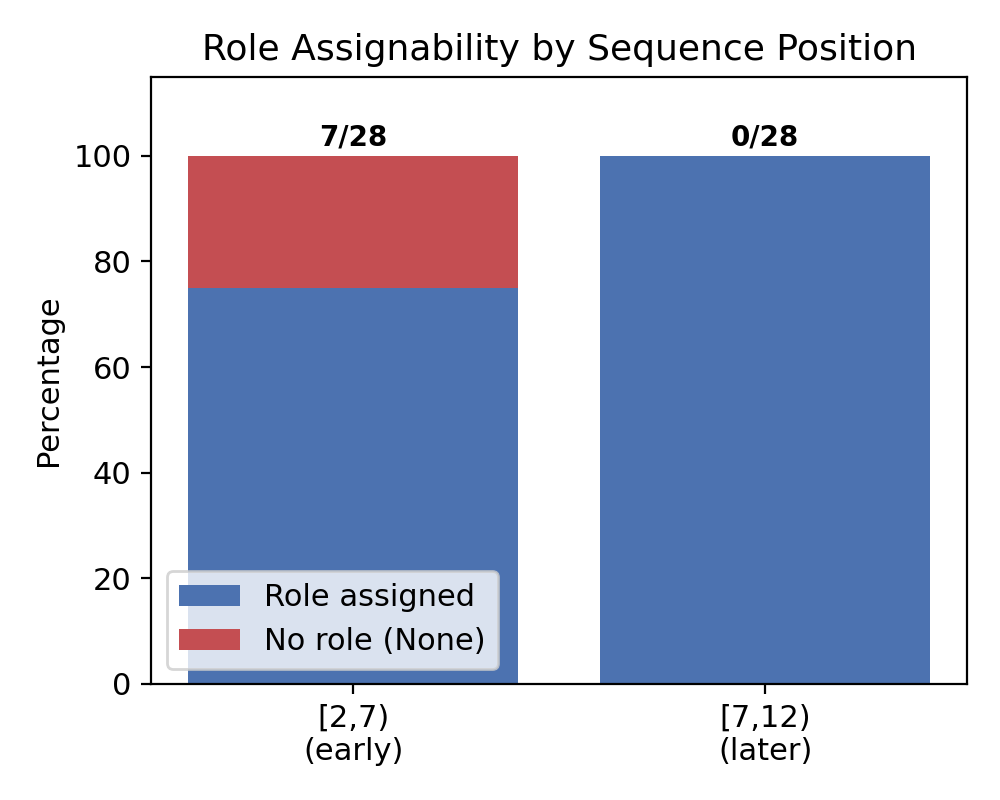
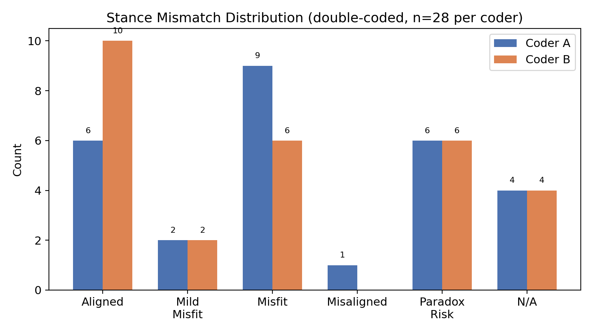
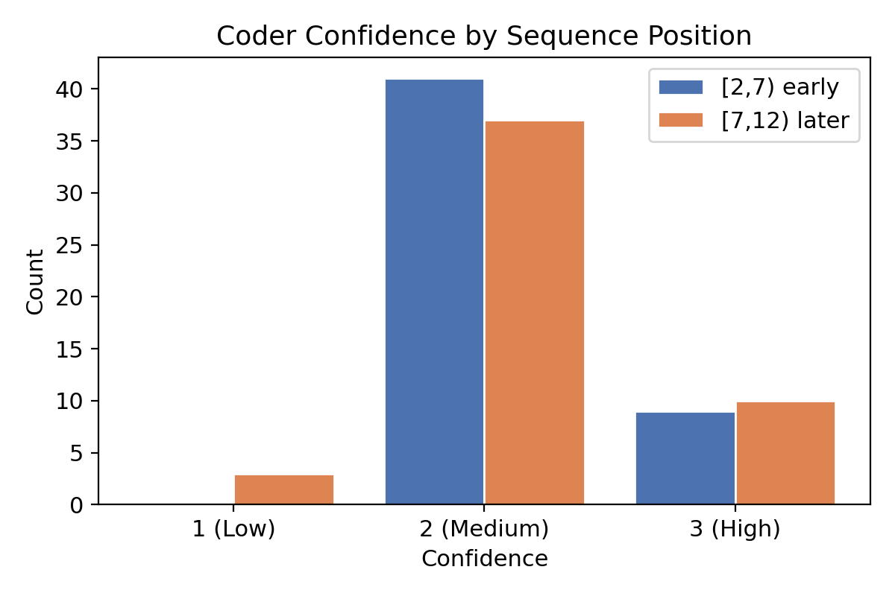
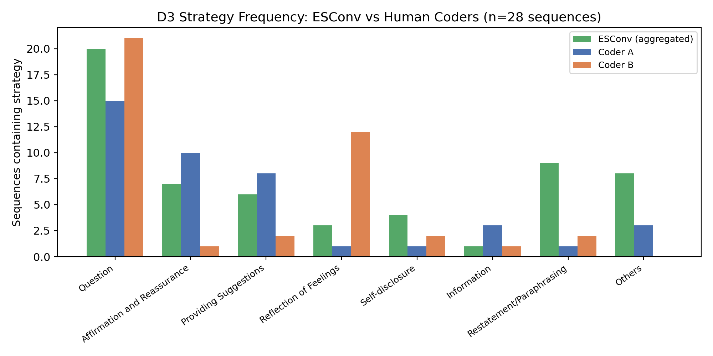
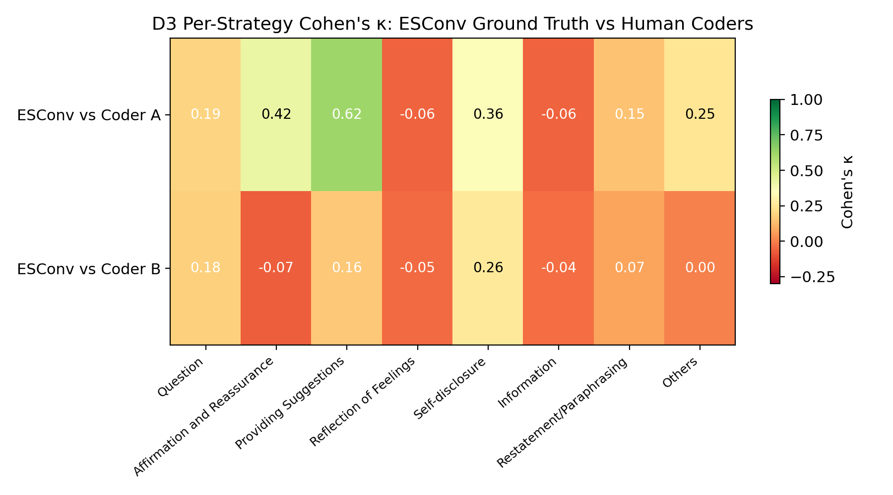
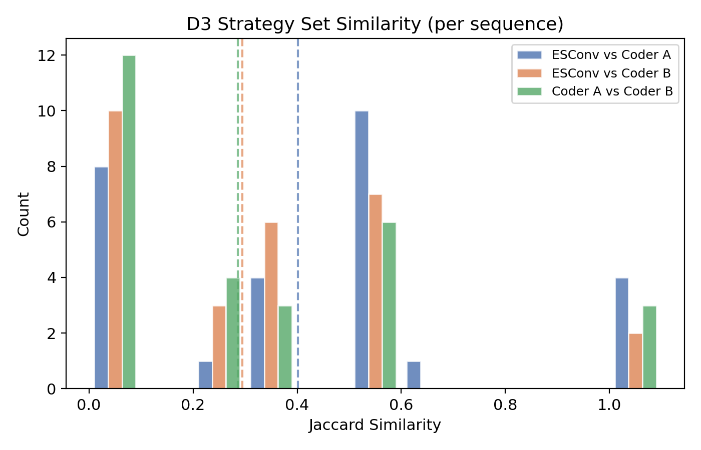

# AROMA Calibration Report #1

**Date:** 2026-03-26
**Coders:** 2 (Coder A: bf32f904, Coder B: 41f829d6)
**Conversations:** ESConv_0 – ESConv_13 (14 conversations, double-coded)
**Sequences:** 28 per coder (56 total annotations)
**Sequence window:** 5 turns each — `[2,7)` (early) and `[7,12)` (later)

> **Note:** Coder A also completed ESConv_14–24 (11 additional conversations, 22 sequences) which are excluded from this report. All analyses below use only the 28 sequences both coders labeled.

---

## 1. D1 — Support Type Distribution

Both coders show the same dominant pattern: Emotional support is the most common category. However, there are clear differences:
- **Coder A** assigns Emotional more often (14 vs 8) and uses "None" less
- **Coder B** assigns "None" more frequently (6 vs 4), consistent with a stricter threshold for when support begins
- Esteem, Network, and Tangible appear only sporadically. **Appraisal is absent entirely.**

The Emotional/Informational skew is a property of ESConv, not a coder artifact — both coders agree on the overall shape.

---

## 2. D2 — Care Role Distribution

The biggest coder divergence is here:
- **Coder A** codes more **Advisor** (8 vs 5) and **Listener** (9 vs 10 — similar)
- **Coder B** codes more **Reflective Partner** (7 vs 4) and **None** (3 vs 2)

This suggests a systematic calibration difference: what Coder A reads as directive intent (Advisor), Coder B reads as still probing/reflective (Reflective Partner). Coach and Navigator are marginal for both. **Companion is absent.**

---

## 3. D3 — Support Strategy Frequency

Question dominates for both coders. Key differences:
- **Coder A** uses "Affirmation and Reassurance" and "Providing Suggestions" more — aligning with the more directive D2 coding pattern
- **Coder B** uses "Reflection of Feelings" more — aligning with the more reflective D2 pattern

### Multi-Label Distribution

Coder A multi-labels more often (more 2- and 3-strategy sequences), while Coder B tends toward single labels. Both find multi-labeling natural — D3 captures observable co-occurring behaviors more reliably than D2's single-role assignment.

---

## 4. The Short-Sequence Problem

Early `[2,7)` sequences receive "None" labels significantly more often than `[7,12)` sequences. Early turns are frequently intake or small talk — the supporter asks opening questions and the seeker describes their situation. Within 5 turns, coders often can't tell whether this will lead to listening, reflecting, or advising.

### Implications
- Questions in early sequences are ambiguous: small talk, rapport-building, or information-gathering that will lead to a role — but the short window doesn't reveal which
- Breaking conversations into short sequences means **losing the trajectory**
- The codebook needs explicit guidance: does early intake count as "Listener" or "None"?

---

## 5. Inter-Rater Agreement

### D2 — Care Role (Exact Agreement: 36%)

Three systematic disagreement clusters:

| Boundary | Count | Pattern |
|---|---|---|
| **Listener ↔ Reflective Partner** | 6 | Disagreement on whether the supporter is merely acknowledging or actively synthesizing/reframing |
| **None ↔ Listener** | 4 | One coder sees incipient listening; the other sees no role yet |
| **Advisor ↔ Reflective Partner** | 3 | The teleological distinction (guiding toward action vs. building insight) is hard to operationalize in 5-turn windows |

### D1 — Support Type (Exact Agreement: 46%)

Higher than D2 but still below acceptable calibration thresholds. Much of the disagreement comes from early sequences: one coder codes "None" (no support yet), the other codes "Emotional" (interpreting questions as emotional engagement).

---

## 6. Stance Mismatch

- **Coder A** flags more "misaligned_paradox_risk" — sees supporters overstepping their relational position more often
- **Coder B** assigns more "misfit" — sees a softer mismatch between approach and situation
- Both agree that fully aligned support is the minority

The combined misfit + paradox_risk prevalence supports the theoretical prediction that ESConv supporters frequently operate beyond their relational warrant.

---

## 7. Coder Confidence

Confidence is moderate for both sequence positions (mostly score 2). The 3 lowest-confidence annotations (score = 1) all involve ambiguous role boundaries — the same cases driving inter-rater disagreement.

---

## 8. Key Findings and Codebook Recommendations

### Finding 1: Systematic coder divergence on directiveness
Coder A consistently codes more directive roles (Advisor) and strategies (Providing Suggestions, Affirmation), while Coder B codes more reflective roles (Reflective Partner) and strategies (Reflection of Feelings, Question). The adjudication session should focus on establishing shared thresholds for when probing becomes advising.

### Finding 2: D1 and D2 are heavily skewed in ESConv
Emotional and Informational dominate D1. Listener, Advisor, and Reflective Partner dominate D2. Navigator, Companion, Tangible, Network, and Appraisal are effectively absent. **Supplementary corpora will be needed** to validate the full taxonomy.

### Finding 3: Short sequences obscure role emergence
5-turn windows starting at turn 2 frequently capture intake/small talk rather than established support. This produces "None" labels and inflates disagreement. Consider:
- Allowing "Pre-role" or "Establishing" as an explicit early-sequence code
- Extending the first sequence window (e.g., `[2,10)`)
- Adding a "role onset" marker so coders flag when support actually begins

### Finding 4: The Listener/Reflective Partner boundary needs sharpening
This is the #1 source of inter-rater disagreement (6/18 disagreements). Proposed anchors:
- **Listener**: Supporter asks questions and/or acknowledges without adding interpretive content
- **Reflective Partner**: Supporter explicitly reframes, paraphrases with added meaning, or names an emotion the seeker didn't state

### Finding 5: D3 multi-labeling works well
Coders naturally identify multiple strategies per sequence. This dimension captures observable behaviors rather than inferred relational stances, making it the most reliable for the embedding model.

### Finding 6: Questions are ambiguous across all dimensions
"Question" is ubiquitous but functionally heterogeneous — small talk, empathic probing, information gathering, or Socratic coaching. The codebook may benefit from distinguishing question subtypes (e.g., open-ended exploratory vs. directed/clarifying).

---

## 9. D3 Strategy Agreement: ESConv Ground Truth vs Human Coders

ESConv provides turn-level strategy labels (one per supporter turn). To compare with the human sequence-level annotations, we aggregated ESConv's turn-level labels into a strategy set per sequence, then measured agreement against each coder's multi-label D3 set.

### Strategy Frequency Comparison

The biggest divergences between ESConv labels and human coders:
- **Reflection of Feelings**: Coder B labels this 12 times vs ESConv's 3 — a 4x inflation. Coder A barely uses it (1). This is the sharpest coder divergence on any strategy.
- **Restatement/Paraphrasing**: ESConv labels this in 9 sequences, but both coders rarely use it (1–2). Human coders may be absorbing this into other categories (Reflection of Feelings, Question).
- **Others**: ESConv uses this catch-all in 8 sequences; Coder A uses it 3 times, Coder B never. Human coders prefer specific labels.
- **Affirmation and Reassurance**: Coder A aligns with ESConv (10 vs 7), but Coder B almost never uses it (1).

### Per-Strategy Cohen's Kappa

| Strategy | ESConv n | Coder A n | κ (A) | Coder B n | κ (B) |
|---|---|---|---|---|---|
| Question | 20 | 15 | 0.19 | 21 | 0.18 |
| Affirmation and Reassurance | 7 | 10 | 0.42 | 1 | -0.07 |
| Providing Suggestions | 6 | 8 | **0.62** | 2 | 0.16 |
| Reflection of Feelings | 3 | 1 | -0.06 | 12 | -0.05 |
| Self-disclosure | 4 | 1 | 0.36 | 2 | 0.26 |
| Information | 1 | 3 | -0.06 | 1 | -0.04 |
| Restatement/Paraphrasing | 9 | 1 | 0.15 | 2 | 0.07 |
| Others | 8 | 3 | 0.25 | 0 | 0.00 |

Only one strategy reaches "substantial" agreement (κ > 0.6): **Providing Suggestions** for Coder A. Most kappas are in the slight-to-fair range (0.0–0.4). Question has low kappa despite both coders and ESConv using it frequently — agreement on presence is high, but so is baseline prevalence, which deflates κ.

### Set-Level Similarity

| Comparison | Mean Jaccard | Median Jaccard | Exact Match |
|---|---|---|---|
| ESConv vs Coder A | 0.40 | 0.50 | 14.3% |
| ESConv vs Coder B | 0.30 | 0.33 | 7.1% |
| Coder A vs Coder B | 0.29 | 0.25 | 10.7% |

Coder A is closer to ESConv ground truth (mean Jaccard 0.40) than Coder B (0.30). Notably, the two human coders agree with each other *less* than either agrees with ESConv — the inter-coder Jaccard (0.29) is the lowest of the three comparisons.

### Interpretation

The low kappa and Jaccard scores reflect a fundamental unit-of-analysis mismatch: ESConv labels individual turns, while human coders label 5-turn sequences holistically. A coder seeing a sequence with 3 questions and 1 suggestion may label it "Question; Providing Suggestions," while ESConv has 3 separate "Question" labels and 1 "Providing Suggestions" label — the sets match, but only by coincidence. The bigger issue is that human coders interpret strategies differently from ESConv's original annotators:
- **Restatement/Paraphrasing** is systematically under-coded by humans (1–2 vs ESConv's 9), likely absorbed into Reflection of Feelings or Question
- **Reflection of Feelings** is systematically over-coded by Coder B (12 vs ESConv's 3), suggesting a broader interpretation of what counts as reflecting feelings
- The "Others" catch-all is avoided by human coders, who prefer specific strategy labels

---

## Next Steps

1. **Coder B completes ESConv_14–24** to achieve full double-coding on all 25 conversations
2. **Adjudication session** on the 18 D2 disagreements — focus on the Advisor vs. Reflective Partner threshold
3. **Codebook v0.3** addressing the Listener/Reflective Partner boundary and early-sequence guidance
4. **Discuss sequence windowing** — extend the first window or add a pre-role code
5. **Plan supplementary corpus** for underrepresented roles and support types
