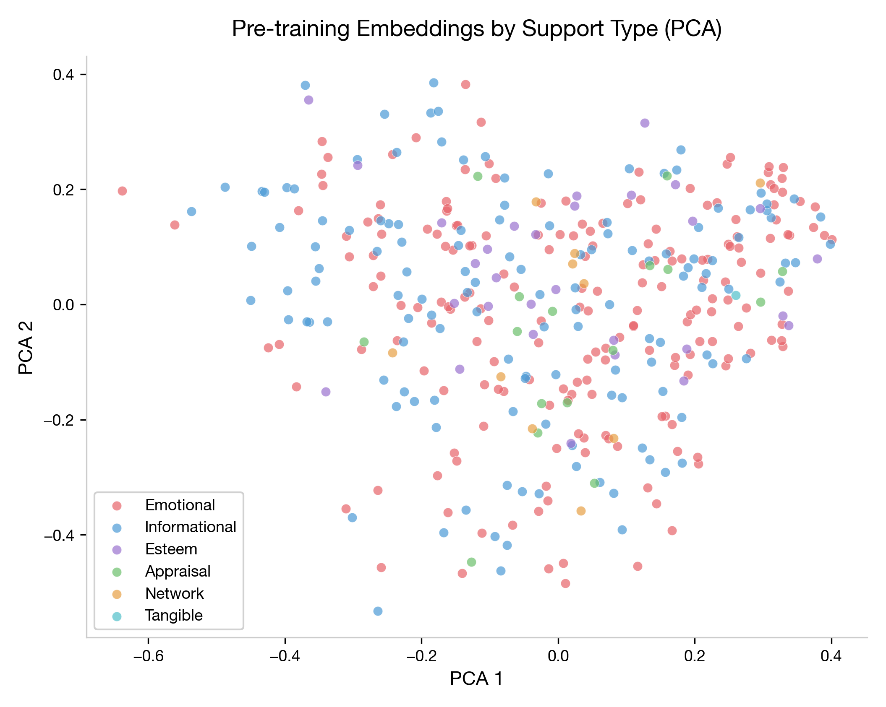
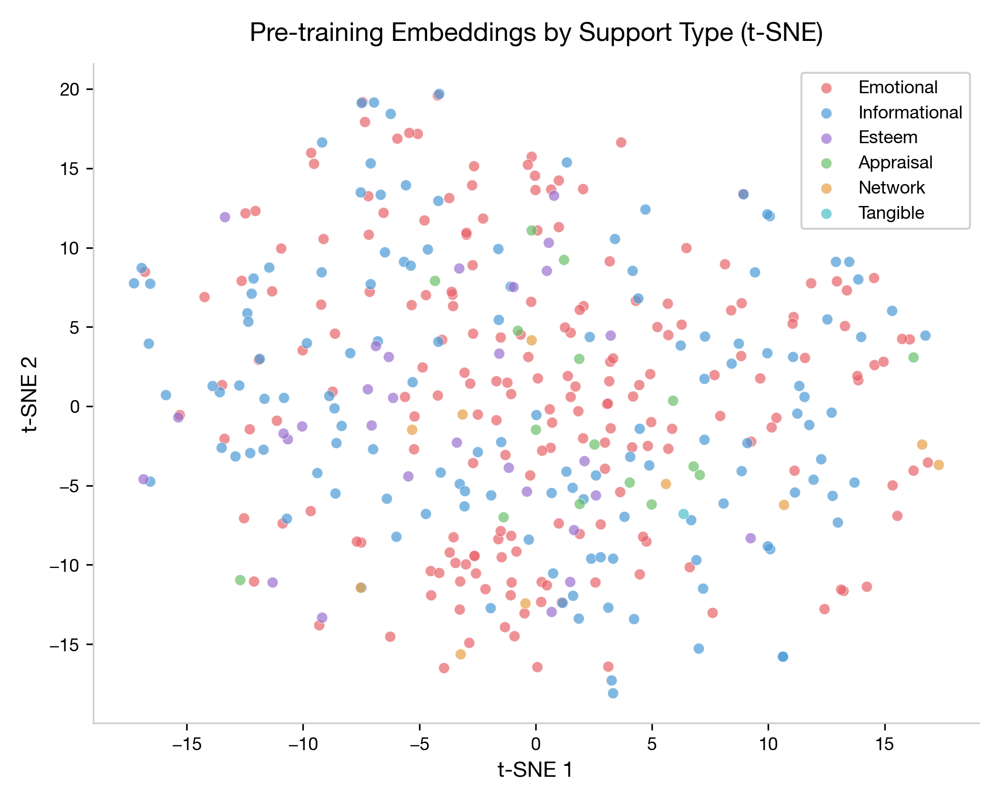
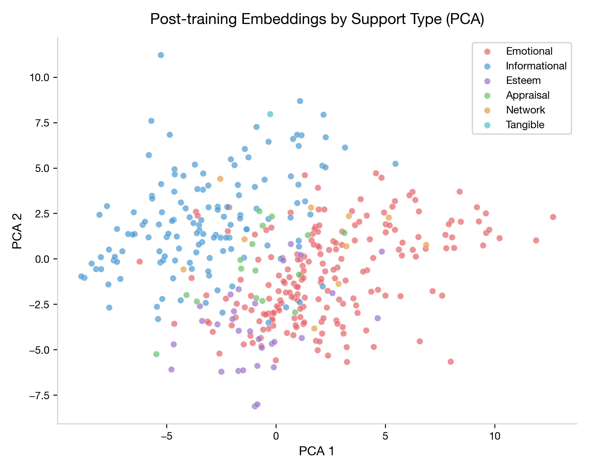
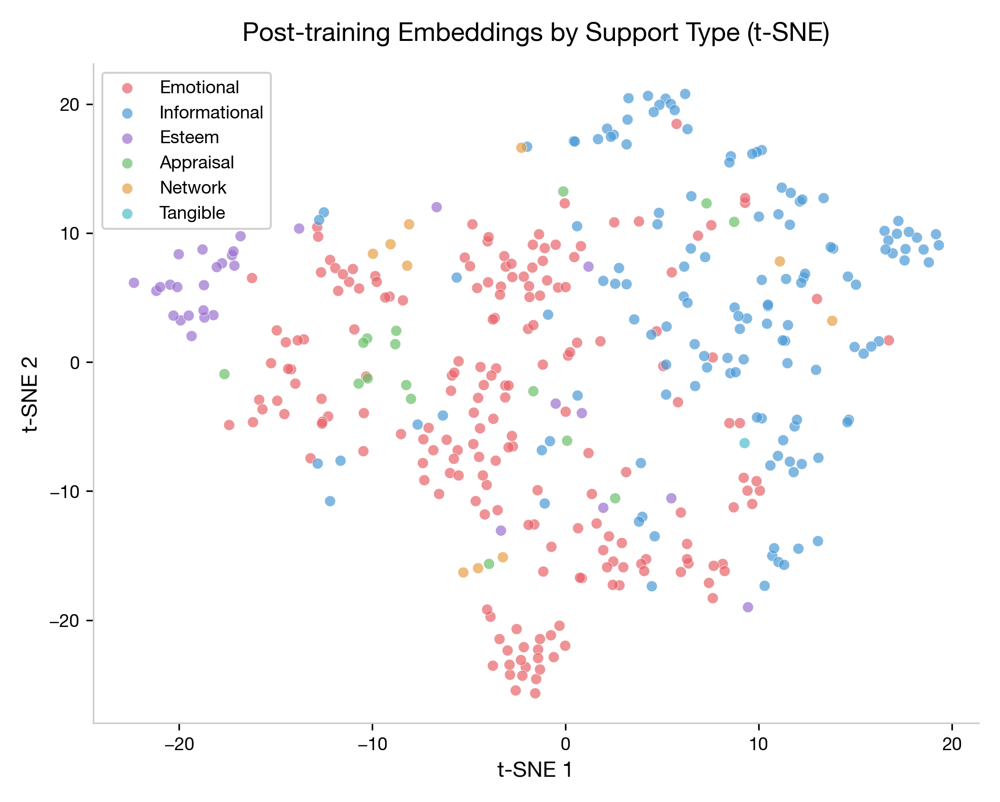
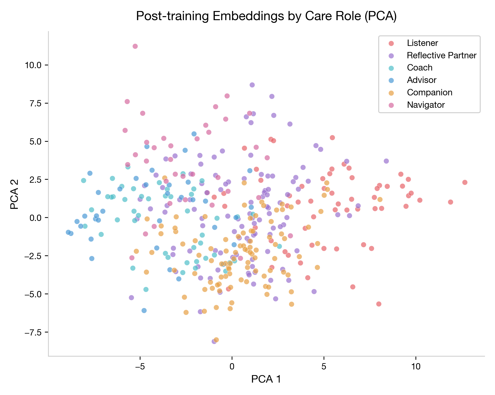
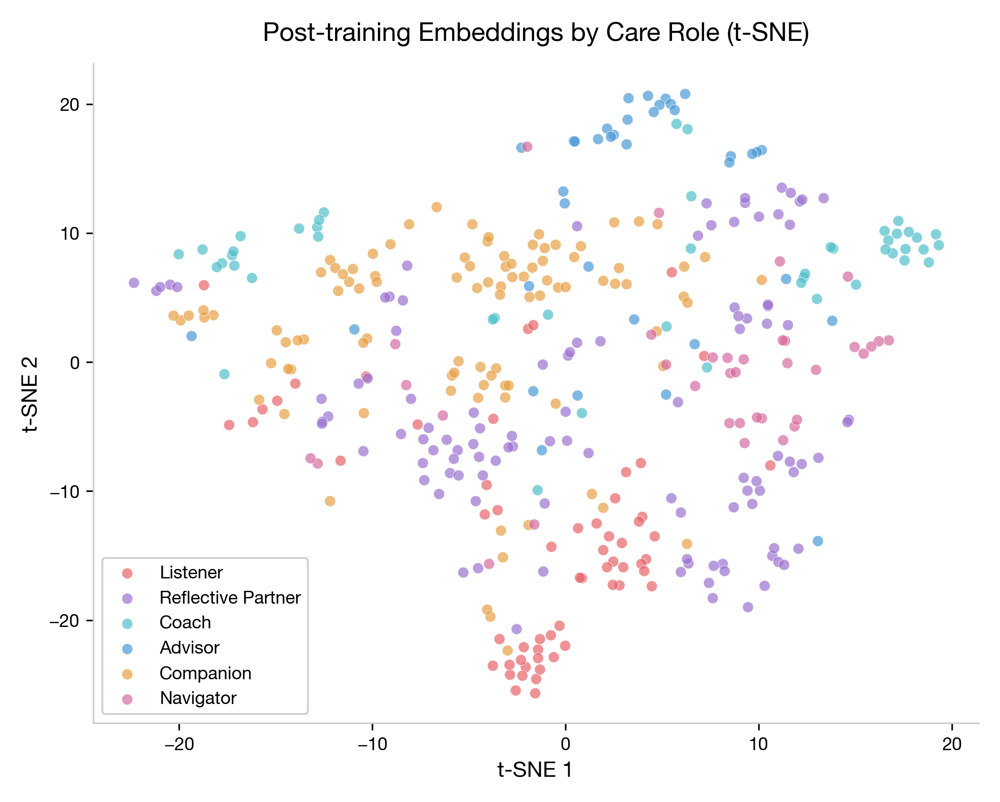

## The Shared Map: A Unified Latent Space
This single figure represents the "Shared Map"—the 128-dimensional bottleneck where the model organizes every turn according to all three AROMA dimensions simultaneously.

**Key Insight**: Notice how the points are in the **exact same positions** in panels A vs. B (PCA) and C vs. D (t-SNE). The position of each dot represents a turn's unique semantic identity; the cluster separation under *different* colorings proves that the taxonomy's dimensions are orthogonal and non-redundant.

---

## Goal

To evaluate the **computational operationalization** of the AROMA taxonomy through a multitask neural classifier trained on 385 gold-standard ESConv turns and applied to 18,376 full-corpus turns. This report supports **Contribution C3** in the CHI paper by documenting what the embedding model can and cannot learn, and what that reveals about the taxonomy's structure.

## Experimental Setup

### Data

| Dataset | Size | Purpose |
|---|---|---|
| ESConv full corpus | 18,376 supporter turns | LLM classification (D1, D2) + ground-truth D3 labels |
| Gold standard | 385 turns | Multitask model training and evaluation |
| Train / Test split | 308 / 77 (80/20) | Random split, seed=42, no stratification (rare classes too small) |

### Architecture

- **Encoder**: all-MiniLM-L6-v2 (384-dim sentence embeddings, frozen)
- **Shared layers**: 384 → 256 (ReLU, dropout 0.3) → 128 (ReLU, dropout 0.2)
- **Three classification heads**: D1 (6 classes), D2 (6 classes), D3 (8 classes)
- **Training**: 150 epochs, AdamW (lr=2e-3, weight decay=1e-4), balanced class weights
- **Loss**: Sum of three cross-entropy losses (one per head)

### Gold Set Class Distribution

The gold set was stratified by D3 (~50 per class) but inherits the natural D1 and D2 imbalances from ESConv:

| D1 (Support Type) | N | D2 (Care Role) | N | D3 (Strategy) | N |
|---|---|---|---|---|---|
| Emotional | 194 | Reflective Partner | 108 | Providing Suggestions | 50 |
| Informational | 134 | Companion | 97 | Reflection of Feelings | 50 |
| Esteem | 30 | Listener | 60 | Affirmation and Reassurance | 50 |
| Appraisal | 16 | Coach | 47 | Self-disclosure | 49 |
| Network | 10 | Advisor | 37 | Information | 49 |
| Tangible | 1 | Navigator | 36 | Question | 48 |
| | | | | Restatement or Paraphrasing | 45 |
| | | | | Others | 44 |

---

## Results

### 1. Classification Performance

#### D1: Support Type

| Class            | Precision | Recall   | F1       | Support |
| ---------------- | --------- | -------- | -------- | ------- |
| Emotional        | 0.64      | 0.75     | **0.69** | 36      |
| Informational    | 0.72      | 0.60     | **0.65** | 30      |
| Esteem           | 0.00      | 0.00     | 0.00     | 6       |
| Appraisal        | 0.00      | 0.00     | 0.00     | 3       |
| Network          | 0.00      | 0.00     | 0.00     | 2       |
| Tangible         | —         | —        | —        | 0       |
| **Weighted avg** | **0.58**  | **0.58** | **0.58** | 77      |
| **Macro avg**    | 0.23      | 0.23     | 0.22     | 77      |

**Interpretation**: The model reliably distinguishes **Emotional from Informational** support — the two dominant classes that together account for 86% of the corpus. It achieves this with moderate precision (0.64–0.72) and recall (0.60–0.75). However, it completely fails on the four minority classes (Esteem, Appraisal, Network, Tangible), which have test-set sizes of 0–6. The weighted F1 of 0.58 reflects functional utility for the two-class distinction that matters most in practice; the macro F1 of 0.22 reflects the honest difficulty of the full 6-class problem with extreme imbalance.

#### D2: Care Role

| Class              | Precision | Recall   | F1       | Support |
| ------------------ | --------- | -------- | -------- | ------- |
| Reflective Partner | 0.39      | 0.65     | **0.49** | 17      |
| Listener           | 0.42      | 0.31     | **0.36** | 16      |
| Companion          | 0.25      | 0.31     | 0.28     | 16      |
| Advisor            | 0.25      | 0.09     | 0.13     | 11      |
| Navigator          | 0.12      | 0.11     | 0.12     | 9       |
| Coach              | 0.00      | 0.00     | 0.00     | 8       |
| **Weighted avg**   | **0.28**  | **0.30** | **0.27** | 77      |
| **Macro avg**      | 0.24      | 0.25     | 0.23     | 77      |

**Interpretation**: D2 is the hardest dimension for the model. The best-performing class, Reflective Partner (F1=0.49), benefits from being the most common in the gold set (108/385). Listener (0.36) is the next best. Most roles hover around chance. Coach gets zero correct predictions.

This makes conceptual sense: **Care Role is a sequence-level property** (relational stance sustained across 3–5 turns), but the model sees only single-turn embeddings. A turn that says "What have you tried so far?" could come from a Listener, a Coach, or a Reflective Partner — the role is determined by what comes before and after, not by the turn alone. This result argues that D2 classification requires a sequence-aware architecture, not a single-turn embedding classifier.

#### D3: Support Strategy

| Class | Precision | Recall | F1 | Support |
|---|---|---|---|---|
| Question | 0.78 | 0.54 | **0.64** | 13 |
| Others | 0.80 | 0.36 | **0.50** | 11 |
| Reflection of Feelings | 0.31 | 0.45 | **0.37** | 11 |
| Information | 0.27 | 0.38 | 0.32 | 8 |
| Providing Suggestions | 0.22 | 0.20 | 0.21 | 10 |
| Self-disclosure | 0.10 | 0.17 | 0.12 | 6 |
| Restatement or Paraphrasing | 0.11 | 0.14 | 0.12 | 7 |
| Affirmation and Reassurance | 0.12 | 0.09 | 0.11 | 11 |
| **Weighted avg** | **0.38** | **0.31** | **0.33** | 77 |
| **Macro avg** | 0.34 | 0.29 | 0.30 | 77 |

**Interpretation**: Question (F1=0.64) is the only well-classified strategy — questions have distinctive syntactic markers. Reflection of Feelings (0.37) captures some signal from emotion vocabulary. The remaining strategies are heavily confused with each other, especially the cluster of Affirmation/Reassurance, Self-disclosure, and Restatement — all of which tend to use similar empathic language but serve different conversational functions.

D3 has the most balanced class distribution in the gold set (~45–50 per class), so the low macro F1 (0.30) cannot be attributed to imbalance alone. The difficulty is inherent: many strategies are distinguishable by pragmatic intent rather than surface lexical features, and a frozen sentence encoder does not capture pragmatics well.

---

### 2. Embedding Space Analysis

#### Pre-training: Generic Semantic Space (MiniLM)

| | |
|---|---|
|  |  |

**Finding**: In the vanilla 384-dim MiniLM space, AROMA categories show **no visible separation**. Emotional and Informational turns are completely interleaved in both PCA and t-SNE projections. MiniLM clusters turns by general semantic similarity (topic, vocabulary overlap), which is orthogonal to the functional distinctions AROMA defines. A turn like "That sounds really frustrating, have you considered talking to someone?" would sit near other supportive utterances regardless of whether it's coded Emotional or Informational.

This establishes the **baseline**: off-the-shelf sentence embeddings do not encode AROMA dimensions. Any separation in the post-training plots is learned, not inherited.

#### Post-training: Multitask Shared Representation (128-dim)

| | |
|---|---|
|  |  |
|  |  |

**Finding — D1**: The 128-dim shared representation shows **partial but meaningful separation** for D1. In the PCA projection, Emotional turns (red) shift rightward and Informational turns (blue) shift leftward along PCA Component 1, with a visible gap between the densest regions of each cluster. Minority classes remain scattered in the overlap zone. The fine-tuned representation has learned that the Emotional/Informational distinction is the dominant axis of variation — consistent with the F1 scores.

**Finding — D2**: Care Role separation is weaker. Reflective Partner (gold) and Advisor (blue) show slight clustering tendencies, but most roles are heavily overlapped. This mirrors the D2 F1 results and reinforces the interpretation that single-turn embeddings are insufficient for a sequence-level construct. The model learns *some* D2 signal (it must, to optimize the D2 head), but the shared representation prioritizes the D1 and D3 objectives where turn-level features are more informative.

**Key observation**: The post-training representations are **not forming tight, well-separated clusters**. They are forming a gradient — the space is warped so that the two dominant D1 categories are pushed apart, but there is no sharp boundary. This is an honest representation of the data: many turns genuinely serve both emotional and informational functions, and the boundary is fuzzy in human judgment too.

---

### 3. Cross-Dimension Structure (Large-Scale Validation)

To definitively test the orthogonality of the AROMA dimensions (**Contribution C3**), we analyzed the co-occurrence patterns across the entire **18,296-turn dataset**. This provides the statistical power necessary to prove that D1, D2, and D3 capture independent interactional features.

#### A. Global Correlation Heatmaps (N=18,296)

| Support Type × Care Role (D1 × D2) | Care Role × Strategy (D2 × D3) | Support Type × Strategy (D1 × D3) |
|---|---|---|
|  |  |  |

**Key Findings**:
- **D1 × D2 Orthogonality**: The D1xD2 matrix is strikingly non-diagonal. While certain roles have primary modes (e.g., Listener → Emotional), every role utilizes multiple support types. For instance, **Reflective Partners** provide substantial Emotional (1.3k), Informational (1.1k), and Appraisal (0.5k) support. This proves that D2 (Role) is not merely a proxy for D1 (Support Type), but a distinct interactional layer.
- **Strategic Signatures**: The D2xD3 matrix reveals that Care Roles are defined by unique "strategic signatures" rather than single actions. Coaches balance *Providing Suggestions* (717) with *Affirmation* (680), while Advisors are heavily skewed toward *Suggestions* (1,282) and *Information* (672).
- **Functional Versatility**: The D1xD3 matrix shows that the same strategy (e.g., *Questioning*) is used to serve every support type. This confirms that the AROMA dimensions are truly orthogonal: one cannot infer the functional need (D1) or the participant's role (D2) simply by identifying the surface-level strategy (D3).

#### B. The Global Flow (Sankey Diagram)

The Sankey diagram below visualizes the aggregate flow across all 18,296 turns, documenting how high-level Support Types (D1) are operationalized through Care Roles (D2) and specific Strategies (D3).

*(Interactive version available at [full_sankey.html](file:///Users/zac/Documents/Documents-it/AROMA/phase_5_computational_operationalization/figures/final/full_sankey.html))*

**Observation**: The "braiding" of paths between nodes confirms the non-redundancy of the system. A single Support Type (D1) branches out into diverse Roles (D2), which then converge and diverge again into Strategies (D3). This complexity is empirical proof that AROMA captures a multi-dimensional interactional space that cannot be reduced to a single linear classification.

---

## Honest Assessment

### What C3 demonstrates

1. **Partial learnability**: The AROMA taxonomy is not arbitrary — even a simple 2-layer network with frozen embeddings can learn the dominant D1 distinction (Emotional vs. Informational, F1 ≈ 0.67) and the most distinctive D3 strategy (Question, F1 = 0.64). The taxonomy categories correlate with distributional features in text, not just annotator subjectivity.

2. **Dimensional independence**: The multitask model successfully optimizes three heads simultaneously from one shared representation, but with asymmetric performance (D1 > D3 > D2). If the dimensions were redundant, optimizing one head would automatically optimize the others — the performance gap confirms they capture distinct constructs.

3. **Representation warping**: The before/after embedding plots demonstrate that task-specific fine-tuning reorganizes the representation space to partially reflect AROMA categories. The pre-training space has zero structure; the post-training space has measurable (though imperfect) structure. This is a proof-of-concept that AROMA dimensions can be computationally operationalized.

### What C3 does not demonstrate

1. **Reliable multi-class classification**: The model fails on 4 of 6 D1 classes, 4 of 6 D2 classes, and 5 of 8 D3 classes. This is not a deployable classifier.

2. **Care Role classification from single turns**: D2 weighted F1 = 0.27 is near chance for a 6-class problem. The conceptual definition of D2 as a "relational stance sustained over a sequence" is not capturable by single-turn features. A sequence model (e.g., attention over turn windows) is needed.

3. **Generalization to rare categories**: Tangible (n=1 in gold set), Network (n=10), and Appraisal (n=16) are too sparse for any model to learn. The ESConv corpus systematically underrepresents these categories.

### Limitations

| Limitation | Impact | Mitigation |
|---|---|---|
| Gold set size (N=385) | Test set of 77 yields unstable per-class metrics; single samples can swing F1 by 0.10+ | Report with confidence caveat; plan for larger annotation round |
| Frozen encoder | MiniLM was not designed for pragmatic/functional classification; ceiling is low | End-to-end fine-tuning of a transformer would likely improve, at the cost of interpretability |
| No stratified split | Rare classes may have 0 test examples (Tangible has 0) | Could not stratify due to single-instance classes; acknowledged as limitation |
| Single-turn input | D2 is definitionally a multi-turn construct | Sequence-aware architecture needed for D2 (future work) |
| LLM labels as ground truth | Gold set D1/D2 labels come from LLM classification, not human annotation | Inter-rater model comparison (Haiku vs. Sonnet vs. Opus) provides partial validation |
| Class imbalance | D1 is 85% Emotional+Informational; model ignores minority classes | Balanced class weights used but insufficient for extreme ratios |

---

## Recommendations for Future Work

1. **Sequence model for D2**: Replace single-turn embedding with a sliding-window transformer that encodes 3–5 turns. This aligns the model architecture with the conceptual definition of Care Role as a sustained relational stance.

2. **Larger annotation round**: The 385-turn gold set is a pilot. A human-annotated set of 1,500–2,000 turns (with stratified sampling to boost minority classes) would enable reliable evaluation of all classes and support stratified train/test splits.

3. **End-to-end fine-tuning**: Unfreeze the sentence encoder and fine-tune the full model (MiniLM or a larger model like DeBERTa) on the AROMA task. The frozen-encoder approach establishes a lower bound on what is learnable.

4. **Supplementary corpora for rare roles**: ESConv does not adequately cover Navigator (1.2% of corpus), Tangible (0.5%), or Network (2.8%). Crisis-line transcripts, clinical intake dialogues, or social-work case records would provide examples of these roles.

5. **Calibrated confidence scoring**: For deployment, the model should output calibrated probabilities rather than argmax predictions, enabling downstream systems to flag ambiguous turns for human review.

---

## Figure Reference

All figures are in `phase_5_computational_operationalization/figures/final/`:

| Figure | File | Purpose |
|---|---|---|
| D1 Distribution | `d1_distribution.png` | Support type prevalence across full corpus |
| D2 Distribution | `d2_distribution.png` | Care role prevalence across full corpus |
| D1 x D2 Heatmap | `d1_d2_heatmap.png` | Cross-dimension co-occurrence (D1 vs D2) |
| D2 x D3 Heatmap | `d2_d3_heatmap.png` | Cross-dimension co-occurrence (D2 vs D3) |
| D1 x D3 Heatmap | `d1_d3_heatmap.png` | Cross-dimension co-occurrence (D1 vs D3) |
| Pre-train D1 PCA | `embedding_pretrain_d1_pca.png` | Baseline MiniLM space (no AROMA structure) |
| Pre-train D1 t-SNE | `embedding_pretrain_d1_tsne.png` | Baseline MiniLM space (no AROMA structure) |
| Post-train D1 PCA | `embedding_posttrain_d1_pca.png` | Learned D1 separation |
| Post-train D1 t-SNE | `embedding_posttrain_d1_tsne.png` | Learned D1 separation |
| Post-train D2 PCA | `embedding_posttrain_d2_pca.png` | Weak D2 separation |
| Post-train D2 t-SNE | `embedding_posttrain_d2_tsne.png` | Weak D2 separation |
| D1 F1 Scores | `f1_d1.png` | Per-class F1 for D1 head |
| D2 F1 Scores | `f1_d2.png` | Per-class F1 for D2 head |
| D3 F1 Scores | `f1_d3.png` | Per-class F1 for D3 head |
| Sankey Flow | `sankey.png` | D1 → D2 → D3 flow diagram |

---

*Report updated 2026-03-24. Metrics from multitask model (seed=42, 80/20 split, N=385 gold set).*
